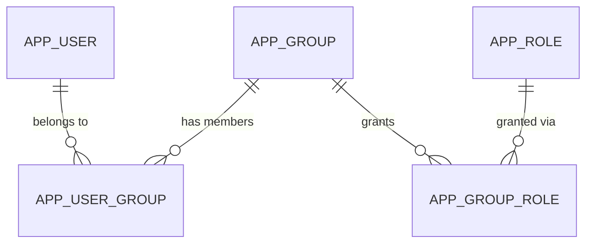
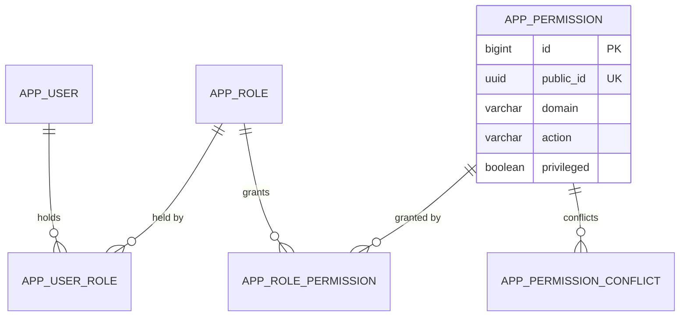

# ADR 0038: Users hold roles, roles hold permissions, and the review follows the privilege

## Status

Proposed. It becomes accepted when the implementation lands. Once accepted it supersedes
[ADR 0022](0022-administrators-cannot-grant-beyond-their-own-roles.md), and partly supersedes
[ADR 0005](0005-keycloak-authentication-local-authorisation.md) (the user, group and role
model), [ADR 0032](0032-periodic-account-review.md) and
[ADR 0037](0037-account-review-populations-and-stored-report.md) (one review interval and one
population of items).

## Context

The model today is user, group, role. A user holds groups, a group holds roles, and a role's
name is the Spring Security authority (`USER_MANAGE` becomes `ROLE_USER_MANAGE`).

This departs from the NIST RBAC model (Sandhu, Ferraiolo and Kuhn), where a user is assigned
roles and a role is assigned permissions. It has these costs.

* "Group" carries the meaning NIST gives a role, and "role" the meaning NIST gives a
  permission, so every reader who knows RBAC has to translate.
* A role is a free-form name that is also an authority. It can be created over the API but
  means nothing unless the code checks that exact name, and a rename once reached a different
  authority ([ADR 0022](0022-administrators-cannot-grant-beyond-their-own-roles.md)). The
  stored name `ROLE_MANAGE` also collides with the `ROLE_` prefix, so it needs
  `hasAuthority("ROLE_ROLE_MANAGE")`.
* Nothing says which authorities are dangerous. The only separation of duties is a convention
  that administrators do not hold `ACCOUNT_REVIEWER`, kept in place by an exemption from the
  "cannot grant beyond your own roles" rule.
* The review has one interval for every account, although the accounts that can change who
  has access matter more than those that cannot.
* A reviewer can edit an account's groups in a review, which needs a special rule that they
  add only groups whose roles they hold.

## Decision

### Model

* **User, role, permission.** A user holds roles directly, a role holds permissions, and a
  user's effective permissions are the union over the user's roles. What was a group is now a
  role, and the old role is now a permission. A user holding a permission through no role is
  not possible.
* **Permission is a domain and an action.** After Apache Shiro's `domain:action`, as two
  columns, unique together. The authority exposed to Spring Security is the literal
  `domain:action` string, with no `ROLE_` prefix, checked with `hasAuthority`. There are no
  wildcards and no instance part. The template has no per-owner or per-tenant resource, so an
  instance would have nothing to name. An adopter that needs one can add a nullable column
  later without breaking anything.
* **Permissions are reference data.** Liquibase seeds them, `GET /admin/permissions` is read
  only, and a `Permissions` constants class names each one. A test fails if the seed and the
  constants differ. Roles stay editable, including their names, because a name is no longer an
  authority, so `PUT /admin/roles/{id}` returns and the reserved-role rule goes.
* **Privileged flag.** A column on the permission, set by the seed and not editable over the
  API, so nobody can downgrade a permission to stay out of the monthly review. An account is
  **privileged** when any of its active roles holds a privileged permission. The status is
  computed, not stored, and the user responses expose it as a read-only `privileged` boolean.

### Catalogue

| Domain | Actions (privileged marked **P**) |
| --- | --- |
| `application` | `access` |
| `user` | `read`, `create` **P**, `update`, `add-role` **P**, `remove-role`, `suspend`, `unsuspend` **P**, `remove`, `revoke-session`, `remove-passkey` |
| `role` | `read`, `create`, `update`, `delete`, `add-permission` **P**, `remove-permission` |
| `permission` | `read` |
| `settings` | `read`, `update` **P** |
| `audit` | `read` |
| `review` | `read`, `decide`, `confirm-population`, `download-report` |

Granting access is privileged and withdrawing it is not. `user:unsuspend` is privileged
because it restores access that a role still carries, which has the effect of adding the role.
`role:create` is not, because an empty role grants nothing, and `role:add-permission` is the
privileged step. Reading the settings is not privileged and changing them is.

Seeded roles: `Administrators` holds every permission except `review:*`. `Account Reviewers`
holds `review:*`, `user:read`, `role:read`, `audit:read`, `user:remove`, `user:remove-role` and
`application:access`. `Users` holds `application:access` and is a development fixture.

### Separation of duties

`app_permission_conflict` is a reference table of permission pairs that one user may not hold
together, seeded with `review:decide` against every privileged permission. It is checked when a
permission is added to a role and when a role is added to a user, against the user's combined
permissions, and a breach is rejected with 409 and an audit event. A table of role pairs was
rejected because a new role holding both sets would bypass it. This is NIST's static separation
of duty. Role hierarchy and dynamic separation of duty are not adopted: inherited privilege
makes the privileged computation harder to audit, and every request already uses all of a
user's roles with no session activation.

### Granting

An actor can grant only the privileged permissions they hold themselves, whether by giving a
user a role or a role a permission. Non-privileged permissions are reads, removals and review
actions, so anyone with the privileged add permission can grant them. This restates
[ADR 0022](0022-administrators-cannot-grant-beyond-their-own-roles.md), and the reviewer
exemption is no longer needed because the conflict table keeps administrators from holding
`review:decide`. The self-modification rule stays: an actor cannot change their own roles, or
suspend or remove themselves. As before, there is no guard that keeps a last holder, and the
first-administrator changeset is the recovery.

### Reviewer

A review removal needs both `review:decide` and the underlying `user:remove` or
`user:remove-role`. The reviewer's seeded role has no add permission, so "can remove roles or
users but cannot add roles or users" follows from the permissions, and the rule that a reviewer
adds only roles they hold goes. A reviewer holds no privileged permission, so a reviewer is a
non-privileged account and falls in the yearly review.

### Review classes

The review splits in two, each with its own tasks, items, populations, report and due date.

* **Privileged Account Review** covers the accounts that are privileged at task creation. It
  also holds the suspended and removed populations, so the evidence that suspension and
  removal work is gathered at the stricter cadence.
* **Non-privileged Account Review** covers the other active accounts.

An item freezes the account's class and the privileged permissions it held, as text beside
`groups_before`, so the stored report shows why an account was in the monthly review. An
account whose class changes mid-task stays in the task it was counted in. The task has a type,
`PRIVILEGED_ACCOUNT_REVIEW` or `NON_PRIVILEGED_ACCOUNT_REVIEW`. The item's frozen `groups_before`
and `groups_after` become role lists, and the review endpoint that edits groups edits roles.

Settings `review.privilegedIntervalMonths` (default 1) and
`review.nonPrivilegedIntervalMonths` (default 12) replace `review.intervalMonths`. Each takes
1, 3, 6 or 12 and keeps the rule that a task is created in a month where `(month - 1) mod N = 0`.
The settings API also rejects a non-privileged interval shorter than the privileged one.
`review.enabled` stays one switch for both. The development seed sets both to 1.

### Vocabulary

"Privileged account", "privileged permission", "non-privileged account" and "separation of
duties" follow NIST SP 800-53 Rev 5 (AC-2(7), AC-6(5), AC-6(7), AC-6(10), AC-5). The control
leaves the review frequency to the organization, so the monthly and yearly defaults are local
policy that an adopter tunes in the settings. The glossary records the terms.

### Audit and schema

The audit actions for groups and roles are renamed to role and permission events. New events
record a privileged status change, a separation of duties rejection, and a review's class. The
schema is edited in place and development databases are recreated, as in
[ADR 0037](0037-account-review-populations-and-stored-report.md); no data is migrated.

## Consequences

The model reads as NIST Core RBAC plus static separation of duties, so anyone who knows RBAC
can follow it. The `ROLE_ROLE_MANAGE` special case and the role-rename escalation disappear,
because no name is an authority. The reviewer's limits are visible as a role's permissions
instead of special code, and the collusion risk ADR 0022 accepted for the reviewer role is now
closed by a rule instead of by convention.

Privileged accounts are reviewed monthly by default, which is more work for reviewers in a
deployment with many of them, and the interval is a setting for that reason. A deployment that
gives every user a privileged permission gets a monthly review of everyone.

A user can lose their only privileged role through a role edit, and the account then moves to
the yearly review without anyone having decided it. The change is in the audit trail, and the
class is frozen only when a task is created. The seed, the `Permissions` class and the conflict
table are three places that must agree, which a test checks.

Clients that used the group endpoints, the old role endpoints and the single review interval
must move to the new ones. Because ADR 0037 and the earlier schema changes were also made in
place, there is nothing to migrate.
