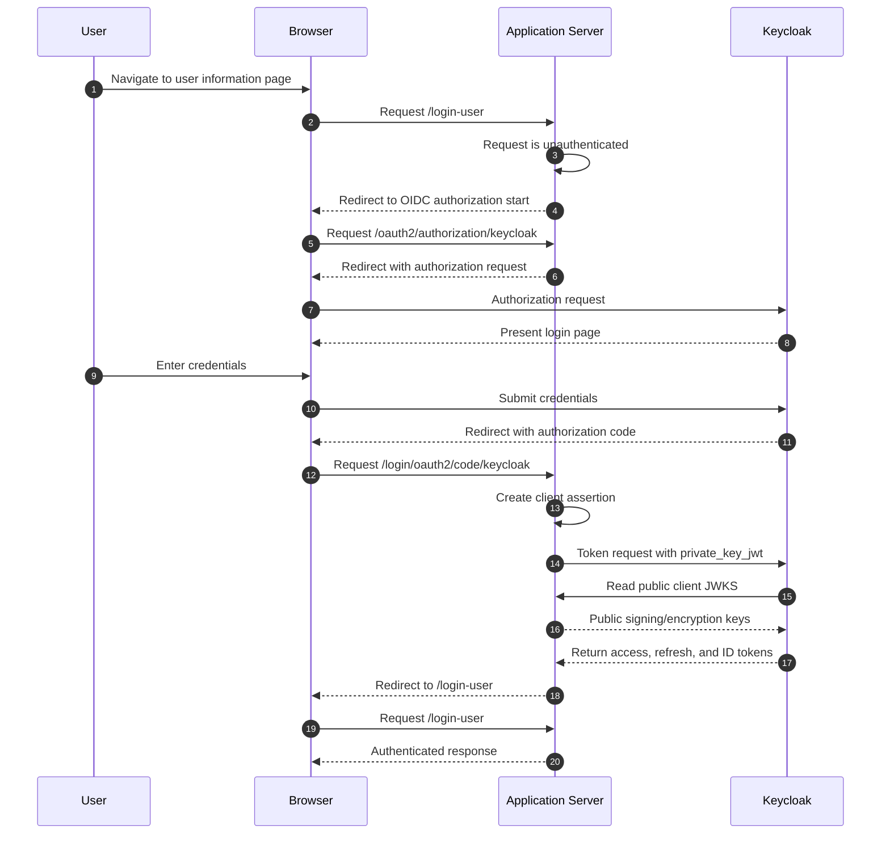

# Security authentication

This document describes the template's OpenID Connect (OIDC) relying-party
configuration. It complements the [Quick Start](../README.md#quick-start), which
covers local Keycloak provisioning and running the application.

## Authentication model

The application is an OIDC relying party for Keycloak. Browser requests are
authenticated with the authorization-code flow; unauthenticated requests are
redirected to the configured provider. All application routes require
authentication except the public `/oauth2/jwks` endpoint.

The template's local Keycloak realm has two clients:

| Client ID | Application URL | Purpose |
| --- | --- | --- |
| `java-app-web-api-server` | `http://localhost:8081` | Local HTTP development |
| `java-app-web-api-server-secure` | `https://localhost:8081` | Local TLS development |

Both clients use `private_key_jwt`, publish the application's public keys
through `/oauth2/jwks`, and are configured for back-channel logout.

## Client authentication

Keycloak uses the `private_key_jwt` client-authentication method. In the
Keycloak administration console this is configured by selecting **Signed JWT**
as the client authenticator.

The client registration declares the same method:

```yaml
spring:
  security:
    oauth2:
      client:
        registration:
          keycloak:
            client-id: java-app-web-api-server
            client-authentication-method: private_key_jwt
            authorization-grant-type: authorization_code
            scope:
            - openid
```

During the authorization-code token exchange,
`RestClientAuthorizationCodeTokenResponseClient` uses
`NimbusJwtClientAuthenticationParametersConverter` with the application's
private signing key to create the client assertion. The corresponding public
signing key is available to Keycloak at `/oauth2/jwks`.

## Application JWKS and key handling

The development JWKS at `src/main/resources/jwks.json` contains private key
material. It is a fixture for local development and tests only; it must not be
deployed.

For a real deployment, provide an equivalent private JWKS through a protected
resource, set `app.jwks` to that resource location, and rotate signing and
encryption keys in coordination with Keycloak. Do not place private JWKs in
source control, container images, or a public JWKS endpoint.

`WebSecurityConfiguration` loads the configured JWKS into a `JWKSet`.
`JwksController` publishes only public key components at `/oauth2/jwks`;
`JWKSet.toString()` does not include private key material.

During a token exchange Keycloak uses that endpoint to obtain:

* The public signing key for verifying the `private_key_jwt` client assertion.
* The public encryption key if ID-token encryption is enabled for the Keycloak
  client.

## ID-token and access-token validation

The custom `JwtDecoderFactory<ClientRegistration>` is used because the default
`OidcIdTokenDecoderFactory` is not sufficiently customizable for encrypted
ID-token support. The current decoder:

* accepts signed RS256 ID tokens;
* selects only keys marked for signature use from the provider JWKS, preventing
  RSA encryption keys and unrelated EC signature keys from being selected;
* applies `OidcIdTokenValidator`, which validates the OIDC ID-token claims for
  the client registration.

The supplied Keycloak configuration does **not** enable ID-token encryption.
The current decoder has no JWE decryption-key selector, so enabling encryption
in Keycloak without a matching decoder configuration will fail authentication.
If encryption is required, configure the selected JWE algorithm and a private
decryption key in the application before enabling it for the Keycloak client.

For role extraction, the application decodes the access token with an
issuer-validating decoder and reads Keycloak's `realm_access.roles` claim from
both the access token and ID token. Roles are exposed as Spring authorities
with the `ROLE_` prefix.

## Logout

### Relying-party initiated logout

`OidcClientInitiatedLogoutSuccessHandler` uses Keycloak's
`end_session_endpoint` when the application logs a user out. It supplies an
`id_token_hint`; after logout, Keycloak redirects the browser to
`{baseUrl}/login?logout`.

### Back-channel logout

The application accepts Keycloak back-channel logout notifications using:

```java
http.oidcLogout(oidcLogout -> oidcLogout.backChannel(withDefaults()));
```

For each Keycloak client:

* Set **Front channel logout** to **Off**.
* Set the Backchannel logout URL to
  `http://localhost:8081/logout/connect/back-channel/keycloak` for local HTTP
  development.

`keycloak` in the path is the Spring client-registration ID. Use the matching
public HTTPS URL for the TLS client in environments where TLS is enabled.

## Authorization-code flow



