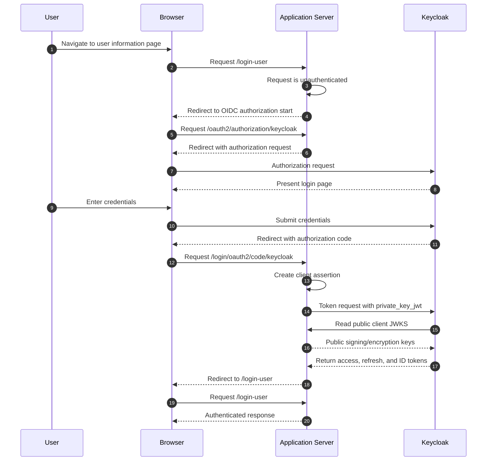

# Security authentication

This document records the authentication posture of the application against the
[OWASP Authentication Cheat Sheet](https://cheatsheetseries.owasp.org/cheatsheets/Authentication_Cheat_Sheet.html).
It describes the template's OpenID Connect (OIDC) relying-party configuration:
the authorization-code flow, JWKS key handling, token validation, and logout.
Credential collection, password policy, storage, brute-force protection, and
multi-factor authentication are Keycloak's responsibility, not this
application's; the production identity provider must also be reviewed against
the cheat sheet.

## Authentication model

The application is an OIDC relying party for Keycloak. Browser requests are
authenticated with the authorization-code flow; unauthenticated requests are
redirected to the configured provider. All application routes require
authentication except the public `/oauth2/jwks` endpoint.

Each Keycloak client configured for the application uses `private_key_jwt`,
publishes the application's public keys through `/oauth2/jwks`, and is
configured for back-channel logout.

## Client authentication

Keycloak uses the `private_key_jwt` client-authentication method. In the
Keycloak administration console this is configured by selecting **Signed JWT**
as the client authenticator.

The client registration declares the same method:

```yaml
spring:
  security:
    oauth2:
      client:
        registration:
          keycloak:
            client-id: java-app-web-api-server
            client-authentication-method: private_key_jwt
            authorization-grant-type: authorization_code
            scope:
            - openid
```

During the authorization-code token exchange,
`RestClientAuthorizationCodeTokenResponseClient` uses
`NimbusJwtClientAuthenticationParametersConverter` with the application's
private signing key to create the client assertion. The corresponding public
signing key is available to Keycloak at `/oauth2/jwks`.

## Application JWKS and key handling

The development JWKS at `src/main/resources/jwks.json` contains private key
material. It is a fixture for local development and tests only; it must not be
deployed.

For a real deployment, provide an equivalent private JWKS through a protected
resource, set `app.jwks` to that resource location, and rotate signing and
encryption keys in coordination with Keycloak. Do not place private JWKs in
source control, container images, or a public JWKS endpoint.

`WebSecurityConfiguration` loads the configured JWKS into a `JWKSet`.
`JwksController` publishes only public key components at `/oauth2/jwks`;
`JWKSet.toString()` does not include private key material.

During a token exchange Keycloak uses that endpoint to obtain:

* The public signing key for verifying the `private_key_jwt` client assertion.
* The public encryption key if ID-token encryption is enabled for the Keycloak
  client.

## ID-token and access-token validation

The custom `JwtDecoderFactory<ClientRegistration>` is used because the default
`OidcIdTokenDecoderFactory` is not sufficiently customizable for encrypted
ID-token support. The current decoder:

* accepts signed RS256 ID tokens;
* selects only keys marked for signature use from the provider JWKS, preventing
  RSA encryption keys and unrelated EC signature keys from being selected;
* applies `OidcIdTokenValidator`, which validates the OIDC ID-token claims for
  the client registration.

The supplied Keycloak configuration does **not** enable ID-token encryption.
The current decoder has no JWE decryption-key selector, so enabling encryption
in Keycloak without a matching decoder configuration will fail authentication.
If encryption is required, configure the selected JWE algorithm and a private
decryption key in the application before enabling it for the Keycloak client.

For role extraction, the application decodes the access token with an
issuer-validating decoder and reads Keycloak's `realm_access.roles` claim from
both the access token and ID token. Roles are exposed as Spring authorities
with the `ROLE_` prefix.

## Logout

### Relying-party initiated logout

`OidcClientInitiatedLogoutSuccessHandler` uses Keycloak's
`end_session_endpoint` when the application logs a user out. It supplies an
`id_token_hint`; after logout, Keycloak redirects the browser to
`{baseUrl}/login?logout`.

### Back-channel logout

The application accepts Keycloak back-channel logout notifications using:

```java
http.oidcLogout(oidcLogout -> oidcLogout.backChannel(withDefaults()));
```

For each Keycloak client:

* Set **Front channel logout** to **Off**.
* Set the Backchannel logout URL to
  `{application base URL}/logout/connect/back-channel/{registration-id}`,
  where `{registration-id}` is the Spring client-registration ID (`keycloak`
  in this template).

## Authorization-code flow



## OWASP review

| OWASP area | Status | Current treatment or required action | Implementation |
| --- | --- | --- | --- |
| User IDs and usernames | Not applicable to the application | Keycloak issues and stores the authenticating identity. The application only consumes the resulting `preferred_username` claim as an immutable local lookup key; it does not mint or manage login usernames itself. | See [Authorization](authorization.md). |
| Segregate authentication for sensitive/internal accounts | Deployment decision | The application does not distinguish an internal/service-account population from browser users. Ensure the Keycloak realm and client used by end users are not also used to authenticate backend, database, or administrative accounts. | **Unimplemented:** Keycloak realm/client topology decision. |
| Password strength, storage, hashing, and safe comparison | Delegated to identity provider | The application never receives, stores, or compares a password; Keycloak owns credential collection, password policy, hashing, and verification. | External: Keycloak. |
| Secure password recovery | Delegated to identity provider | Password reset is a Keycloak realm flow. The application has no forgot-password endpoint. | External: Keycloak. |
| Change password requires an active session and current password | Delegated to identity provider | Handled by Keycloak's account console, not the application. | External: Keycloak. |
| Transmit credentials over TLS | Implemented in application configuration | Credential entry occurs on Keycloak's hosted login page, outside this application. Token exchange and every authenticated application route are TLS-protected by this application's own listener. See [Hardening](hardening.md) sections 6.2-6.5. | **Application configuration:** `server.ssl`; **external:** Keycloak's own TLS configuration. |
| Require re-authentication for sensitive features and after risk events | Not implemented | No step-up or re-authentication requirement is defined for sensitive administration actions (user, group, or role management) or for risk events such as an IP or device change. This mirrors the equivalent open item in [Sessions](sessions.md). | **Unimplemented:** no product decision recorded. |
| TLS client authentication (mTLS) / per-transaction step-up authentication | Not implemented | The application authenticates its own back-channel calls to Keycloak with `private_key_jwt`, not mTLS, and defines no per-transaction second factor. See [Hardening](hardening.md) section 6.1 for the mTLS deployment decision. | **Unimplemented:** no mTLS or transaction-level second factor. |
| Generic authentication error messages | Partial | A failed Keycloak login is handled entirely by Keycloak's own login page. Once Keycloak issues a successful authentication, `LocalAuthoritiesOidcUserService` rejects a missing claim, an unknown local user, and a disabled local user with the same generic `local_user_not_authorized` OAuth2 error, and Spring Security's default failure handler redirects to a generic `/login?error` page. Verify the rendered error page never distinguishes these outcomes from each other or from a Keycloak-side rejection. | **Application code:** `LocalAuthoritiesOidcUserService.unauthorized()`; **Spring Security default:** OAuth2 login failure handling. |
| Protect against automated attacks (brute force, credential stuffing, password spraying) | Delegated to identity provider | The application never sees a submitted password, so it cannot throttle or lock out credential-guessing attempts itself. Login throttling, account lockout, and any CAPTCHA are entirely a Keycloak realm policy. See [Hardening](hardening.md) section 5.2. | External: Keycloak; **not applicable in this template:** there is no application-rendered login form to throttle. |
| Multi-factor authentication | Delegated to identity provider, not enabled by default | Keycloak can require OTP or WebAuthn per realm or per user, but the supplied local development realm does not enable it. Enabling MFA is a production identity-provider decision. | External: Keycloak; **unimplemented:** `bin/configure-keycloak.js` provisions no realm MFA policy. |
| FIDO2/WebAuthn passkeys | Not implemented | Not configured in the supplied realm. | External: Keycloak; product decision. |
| Security questions or memorable words | Not applicable | The application implements no knowledge-based recovery mechanism. | N/A. |
| Log authentication successes and failures | Implemented | `SecurityAuditEventLogger` records login success, login failure, and logout, without credentials or tokens. See [security logging](logging/README.md). | **Application code:** `SecurityAuditEventLogger`. |
| Use a standard, audited authentication protocol rather than a custom scheme | Implemented | The application delegates authentication to Keycloak through Spring Security's OAuth2 Login/OIDC client rather than a custom credential scheme. | **Application configuration:** `spring.security.oauth2.client`; **Spring Security:** `oauth2Login()`. |
| Validate ID tokens: issuer, audience, signature, and expiration | Implemented | Described in [ID-token and access-token validation](#id-token-and-access-token-validation) above. | **Application code:** `jwtDecoderFactory()`, `oidcIdTokenValidator()`. |
| Use well-maintained libraries/SDKs and provider discovery/JWKS | Implemented | Spring Security's OIDC client stack and Nimbus JOSE+JWT are used throughout; keys are discovered through JWKS rather than embedded or hand-rolled cryptography. | **Dependencies:** `spring-boot-starter-oauth2-client`, Nimbus JOSE+JWT. See [ADR 0006](../adr/0006-tls-and-oauth-client-key-management.md). |
| SAML | Not applicable | The template uses OIDC exclusively. | N/A. |
| Password-manager compatibility (form field types, paste, tab order) | Not applicable to the application | The credential-entry form is Keycloak's hosted login page, not an application-rendered form. | External: Keycloak. |
| Self-service email-address change process | Not applicable | The local user's `email` field is maintained only through the administration API by an authorised administrator (see [Authorization](authorization.md)), not through a user-initiated self-service flow, so the cheat sheet's confirmation/nonce process does not apply. | **Application code:** administration API; N/A: no self-service flow exists. |
| Adaptive or risk-based authentication | Not implemented | No device, geolocation, or behavioural risk signal influences the authentication or session outcome. | **Unimplemented:** no product decision recorded. |

## Required production decisions

Before production use, the service owner must record and implement decisions for:

1. Keycloak realm/client topology that keeps internal or service accounts out of
   the browser-facing OIDC client.
2. Whether MFA (OTP, WebAuthn) is required, and for which users or realms.
3. Keycloak brute-force detection: lockout threshold, observation window,
   lockout duration, and whether CAPTCHA is also required.
4. Whether administrative actions or specific risk events require
   re-authentication or step-up MFA, coordinated with [Sessions](sessions.md).
5. Whether mTLS is required for machine/API clients, coordinated with
   [Hardening](hardening.md) section 6.1.
6. Password-recovery, account-lockout communication, and any self-service
   profile-change policy configured in the Keycloak realm.

## Verification

Test the externally deployed service, not just the local profile, for the
following:

1. A login attempt for a missing local user, a disabled local user, and
   Keycloak-rejected credentials all produce the same generic error response.
2. TLS protects the whole authenticated session, including Keycloak's own
   login and consent pages.
3. Login success, login failure, and logout events are recorded by
   `SecurityAuditEventLogger` without credentials or tokens; see
   [security logging](logging/README.md).
4. A tampered, expired, or wrong-audience ID token is rejected.
5. The provisioned realm's brute-force/lockout policy, and any MFA
   requirement, actually take effect.

Related documentation: [Authorization](authorization.md),
[Sessions](sessions.md), [HTTP security headers](headers.md),
[security logging](logging/README.md), [Hardening](hardening.md),
[Security and API error responses](error-responses.md),
[ADR 0004](../adr/0004-keycloak-authentication-local-authorisation.md), and
[ADR 0006](../adr/0006-tls-and-oauth-client-key-management.md).

