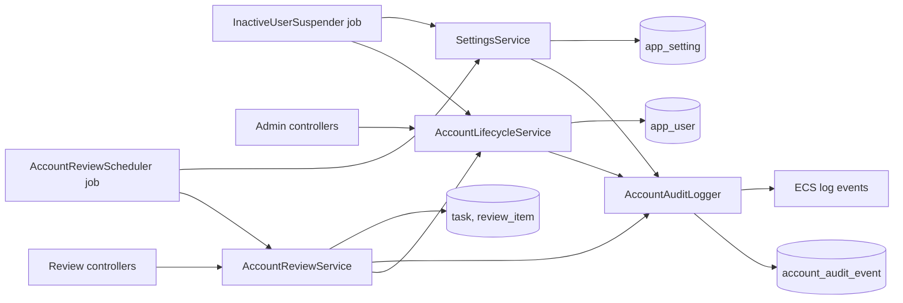

# Design: Account Lifecycle and Periodic Account Review

## Overview

The change adds a lifecycle status to `app_user`, an inactivity job that suspends
and removes accounts, DB-backed settings, a business audit table, and a generic
task table with an account review as its first type. Everything lives in
`commons-accounts` so adopters get it with the accounts module; the sample
application only seeds fixtures and turns the automation off for development.

Decisions are recorded in [ADR 0030](../../adr/0030-business-audit-trail-table.md),
[ADR 0031](../../adr/0031-inactive-account-suspension-and-removal.md) and
[ADR 0032](../../adr/0032-periodic-account-review.md).

## Architecture



`AccountLifecycleService` is the one place that suspends, unsuspends and removes an
account, called by the administration API, the review service and the inactivity
job, so every path enforces the same rules and writes the same audit event. This is
the existing `AdministrationService` operation set, extended; it is not a second
implementation.

`AdministrationAuditLogger` is renamed `AccountAuditLogger` and keeps its ECS
output. It additionally appends the audit row inside the changing transaction, so a
rolled-back change leaves neither a log line nor a row (the log line is still emitted
after commit, as in ADR 0021).

## Decisions

### Status replaces `enabled`

`app_user.enabled` is replaced by `status` (`ACTIVE`, `SUSPENDED`). Authentication
treats `SUSPENDED` as it treated `enabled = false`. The API `status` is the stored
`AccountStatus`, `active` or `suspended` (ADR 0033), and `UserStatus` is removed. An
active account that has never signed in is selected with the `neverSignedIn` filter.

### Inactivity clock

A column `inactivity_clock_started_at` is set on creation and on unsuspend.
`updatedAt` no longer restarts the clock, so a rename or group change does not buy
an inactive account more time (this differs from ADR 0028). The clock is
`greatest(lastLoginAt, inactivity_clock_started_at)`; `lastLoginAt` is only ever
set by a sign-in.

### Hard delete

Removal deletes the row. `account_audit_event` and `review_item` carry the user's ID
and username as plain values, with no foreign key, so they outlive the account. A
soft-deleted row was rejected because a coding mistake could then let a removed
account sign in, and because "removed" would still be personal data held for
nothing. See ADR 0031.

### Review snapshot

Items fix the scope at task creation, show live account data, and freeze the data
the reviewer saw when they decide. See ADR 0032.

## Data model

The schema is the accounts changelog, `com/example/commons/accounts/jdbc/schema.yaml`, written in
Liquibase change types that each database receives as its own type (`UUID`, `VARCHAR`,
`BOOLEAN`, `TIMESTAMP`, `DATE`, and a large-text type for JSON), with a generated SQL script per
database beside it ([ADR 0035](../../adr/0035-module-schemas-as-changelog-and-sql.md)).

`app_user` (changed)

| Column | Notes |
|---|---|
| `status` | `VARCHAR(20) NOT NULL`, `ACTIVE` or `SUSPENDED`. Replaces `enabled`. |
| `suspended_at` | `TIMESTAMP`, null unless suspended |
| `suspension_reason_code` | `VARCHAR(40)` |
| `suspension_note` | `VARCHAR(200)` |
| `inactivity_clock_started_at` | `TIMESTAMP NOT NULL`, set on creation and unsuspend |

`account_audit_event` (append-only; the application's repository exposes no update
or delete)

| Column | Notes |
|---|---|
| `id` | `UUID` |
| `occurred_at` | `TIMESTAMP NOT NULL`, indexed |
| `actor` | `VARCHAR(100) NOT NULL`, the username or `system` |
| `action` | `VARCHAR(50) NOT NULL`, such as `suspend_user`, `delete_user`, `update_group`, `update_setting`, `verify_review_item` |
| `target_type` | `VARCHAR(20) NOT NULL`: `USER`, `GROUP`, `ROLE`, `SETTING`, `REVIEW` |
| `target_id`, `target_name` | the ID and the username, group, role, setting or task name |
| `target_full_name` | `VARCHAR(100)`, filled for users so a removed account is recognisable |
| `reason_code`, `reason_note` | as in R1 |
| `details` | `TEXT`, JSON: `{"before": ..., "changes": ..., "rolesAdded": [], "rolesRemoved": [], "groupsAdded": [], "groupsRemoved": []}`; never an email address |

Indexes on `(target_type, target_name)`, `actor`, and `action`.

`app_setting`: `name VARCHAR(100)` primary key, `value VARCHAR(100) NOT NULL`,
`updated_at`, `updated_by`. Names are the keys in R3.1; unknown names are rejected.

`task`: `id`, `type VARCHAR(40)`, `status VARCHAR(20)` (`OPEN`, `COMPLETED`),
`start_date DATE`, `due_date DATE`, `created_at`, `completed_at`, `completed_by`,
and a unique constraint on `(type, start_date)`. That constraint is the guard
against two instances creating the same window's task; a portable "one open task"
index is not available, so the service enforces that in code.

`review_item`: `id`, `task_id` (foreign key to `task`), `user_id UUID` and
`username VARCHAR(100)` (no foreign key to `app_user`), `name`, `review_status`
(`PENDING_VERIFICATION`, `VERIFIED`, `REMOVED`), and the frozen decision columns
`decided_at`, `decided_by`, `decided_account_status`, `decided_last_login_at`,
`decided_suspended_at`, `decided_reason_code`, `decided_reason_note`. Unique on
`(task_id, user_id)`; indexes on `(task_id, review_status)`.

Passkey credential rows reference the user, so removal deletes them first, in the
same transaction.

## Components and interfaces

| Component | Responsibility |
|---|---|
| `AccountLifecycleService` | Suspend, unsuspend, remove; checks R1; calls the audit logger and `SessionRevocationService`; marks open review items removed when the actor is the system |
| `InactiveUserSuspender` | Renames `DormantUserDisabler`. `@Scheduled` job; reads `inactivity.*` settings; suspends then removes; skips when disabled |
| `SettingsService` | Reads and validates the five settings; audits changes |
| `AccountAuditLogger` | Renames `AdministrationAuditLogger`; appends the row and writes the ECS event |
| `AccountReviewScheduler` | `@Scheduled` job; computes the current window; creates the task and items |
| `AccountReviewService` | Lists tasks and items, applies decisions, computes categories, completes tasks |
| `TaskController`, `AccountReviewController`, `SettingsController`, `AuditEventController` | REST endpoints below |

The inactivity properties become `commons.accounts.inactivity.check-interval`; the
old `commons.accounts.dormancy.*` properties are removed, since the thresholds move
into the settings table. A clock is injected, as in `DormantUserDisabler`, so time
can be controlled in tests.

### Window calculation

```
windowIndex = floor((year * 12 + (month - 1)) / N)
startMonthIndex = windowIndex * N
startDate = first day of that month; dueDate = last day of month (startMonthIndex + N - 1)
```

in the application's time zone. N is read when the scheduler runs; an open task is
never recomputed.

### Category query

- **Active:** items whose account exists with status `ACTIVE`.
- **Suspended:** items whose account exists with status `SUSPENDED`.
- **Removed:** audit events with `action = delete_user` and `occurred_at` inside the
  task's window, so removals of accounts that were never in the task also appear.

The item table is joined to `app_user` on `user_id` for the live view. An item whose
account is gone appears only through the removed category and its frozen data.

## REST API

All endpoints require authentication. State-changing calls need a recent login
(ADR 0023), now also on `/account-reviews/**` and `/admin/settings`.

| Endpoint | Authority | Operations |
|---|---|---|
| `/admin/users/{id}/suspend`, `/unsuspend`, `/remove` | `USER_MANAGE` | `POST`. `suspend` and `remove` take `{reasonCode, note}`. `204`. Replaces `DELETE /admin/users/{id}` and the `enabled` field. |
| `/admin/settings` | `SETTINGS_MANAGE` | `GET`, `PUT` (whole object) |
| `/audit-events` | `ACCOUNT_REVIEWER` or `USER_MANAGE` | `GET` list |
| `/tasks` | `ACCOUNT_REVIEWER` | `GET` list; `/tasks/summary` `GET` |
| `/account-reviews/tasks/{taskId}` | `ACCOUNT_REVIEWER` | `GET` |
| `/account-reviews/tasks/{taskId}/items` | `ACCOUNT_REVIEWER` | `GET` list |
| `/account-reviews/tasks/{taskId}/decisions` | `ACCOUNT_REVIEWER` | `POST` |
| `/account-reviews/tasks/{taskId}/items/{itemId}/suspend`, `/unsuspend` | `ACCOUNT_REVIEWER` | `POST` |

### DTOs

| DTO | Fields |
|---|---|
| `SuspendRequest`, `RemoveRequest` | `reasonCode` (enum), optional `note` (max 200) |
| `Settings` | `inactivity.enabled`, `inactivity.suspendAfterDays`, `inactivity.removeAfterDays`, `review.enabled`, `review.intervalMonths` |
| `TaskSummaryItem` | `id`, `type`, `status`, `startDate`, `dueDate`, `completedAt`, `completedBy`, `overdue`, `counts{pendingVerification, verified, removed}` |
| `TaskSummary` | `openCount`, `earliestDueDate`, `overdueCount` |
| `ReviewItem` | `id`, `userId`, `username`, `name`, `category`, `reviewStatus`, `ownAccount`, `lastLoginAt` (active), `suspendedAt`, `reasonCode`, `reasonNote` (suspended), `removedAt`, `reasonCode`, `reasonNote` (removed), `decidedBy`, `decidedAt` |
| `DecisionRequest` | `itemIds` (1 to 100), `decision` (`verify` or `remove`), `reasonCode` and `note` required for `remove` only |
| `AuditEvent` | the columns above, with `details` as an object |

Dates are ISO 8601. Times are UTC instants. IDs are UUID strings.

### List contract

Lists follow [ADR 0027](../../adr/0027-admin-list-api-contract.md): `page`, `size`,
repeatable `sort`, `search`, and the response envelope.

| Resource | Filters | Sort fields |
|---|---|---|
| `/tasks` | `type`, `status` | `startDate`, `dueDate`, `completedAt` |
| Review items | `category` (`active`, `suspended`, `removed`), `reviewStatus` | `username`, `name`, `lastLoginAt`, `suspendedAt`, `removedAt` |
| `/audit-events` | `actor`, `targetType`, `targetName`, `action`, `occurredFrom`, `occurredTo` | `occurredAt` |

### Errors

Problem Details as elsewhere. Reviewing one's own account is the ordinary access-denied `403`; a batch with items that are already decided or not in the task is a `409` whose message lists their IDs. Invalid settings are the usual validation-failed `400`, and a change after a stale login is `urn:problem:reauthentication-required` (`401`).

## Security configuration

- `/admin/settings` requires `ROLE_SETTINGS_MANAGE`; the review endpoints and
  `/tasks/**` require `ROLE_ACCOUNT_REVIEWER`; `/audit-events` requires either
  `ROLE_ACCOUNT_REVIEWER` or `ROLE_USER_MANAGE`.
- `AdminReauthenticationInterceptor` covers `/account-reviews/**` and `/admin/settings`.
- The self-review rule compares the item's `user_id` with the authenticated user's
  ID, never the username a client sends.
- ADR 0022 applies to `SETTINGS_MANAGE`. `ACCOUNT_REVIEWER` is exempt, so an
  administrator can maintain the `Account Reviewers` group without holding the role;
  see Decisions on reviewer delegation.

## Initial fixtures

Reference data (all environments): the roles `ACCOUNT_REVIEWER` and
`SETTINGS_MANAGE`; the `Account Reviewers` group with `ACCOUNT_REVIEWER`;
`SETTINGS_MANAGE` added to `Administrators`; the five setting defaults.

Development (`dev` context, `development-seed.sql`, edited in place, so existing
development databases must be recreated): the users in R10.3 with names and email
addresses, the `Users` group replacing `Test Users`, and the two settings
`inactivity.enabled` and `review.enabled` set to false. Where the schema migration
adds `status`, existing seed rows are `ACTIVE` with a fixed clock; since automation is
off in `dev`, the fixed 2026 dates are harmless.

`bin/seed-test-data.js` creates the same five users. For each it sets `firstName`,
`lastName` and `email` from one list so Keycloak does not ask for profile
completion, with password `password`. The username is the `preferred_username`.

## Error handling

Business rule failures are `403` or `409` with the problem types above and an `iam`
failure event, as in ADR 0021. A job failure is logged and retried at the next run;
each account is processed in its own transaction so one failure does not block the
rest. Batch decisions are one transaction.

## Testing strategy

- **Service tests:** the lifecycle transitions and invariants (R1); clock rules
  including unsuspend not touching `lastLoginAt`; thresholds and the system actor;
  window arithmetic for N of 1, 3, 12 and across a year; the one-task-per-window
  guard; decisions all-or-nothing; the self-review rule; settings validation.
- **JPA tests:** removal deletes memberships and passkeys, leaves audit and item rows,
  and leaves no foreign key violation.
- **Job tests:** `InactiveUserSuspender` with a controlled clock; two concurrent runs;
  an automated removal marking an open item `removed`.
- **MockMvc:** every endpoint, authority, validation problem, and `401
  reauthentication-required`.
- **Migration test:** the extended `DatabaseChangelogTest` asserts seeds, the status
  mapping of existing rows and the migration-time clock.
- **Regression:** the full Maven suite and formatter, with existing tests updated for
  the renamed fixtures and the `status` field.

## Requirement traceability

| Requirements | Design coverage |
|---|---|
| R1 | Status replaces `enabled`, hard delete, `AccountLifecycleService` |
| R2 | Inactivity clock, `InactiveUserSuspender` |
| R3 | `SettingsService`, `app_setting`, fixtures |
| R4 | `AccountAuditLogger`, `account_audit_event` |
| R5 | Window calculation, `task`, `AccountReviewScheduler` |
| R6 | Review snapshot, category query, `review_item` |
| R7 | `AccountReviewService`, decisions endpoint |
| R8 | Security configuration, errors |
| R9 | `/tasks`, `/tasks/summary` |
| R10 | Data model migration, initial fixtures |

## Decisions on reviewer delegation

`ACCOUNT_REVIEWER` is exempt from the "grant only what you hold" rule of ADR 0022. An
administrator holding `USER_MANAGE` can add users to `Account Reviewers` and remove
them, although `Administrators` does not hold the role, so no administrator needs
reviewer access to maintain reviewers. The self-modification guard still applies and
every change is in the audit trail, which reviewers can read. Two administrators
colluding could still grant reviewer access; with few administrators, that is
accepted as ADR 0022 accepts the same for administrators removing each other.
`SETTINGS_MANAGE` stays under the rule.
