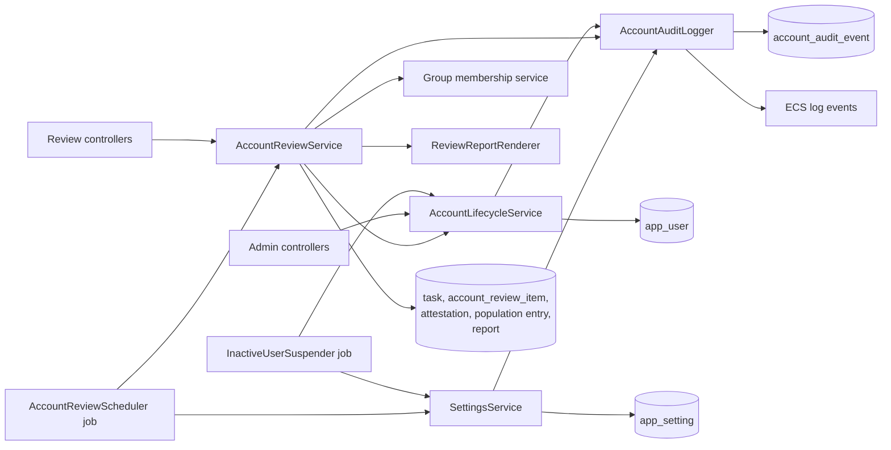

# Design: Account Lifecycle and Periodic Account Review

## Overview

The change adds a lifecycle status to `app_user`, an inactivity job that suspends
and removes accounts, DB-backed settings, a business audit table, and a generic
task table with an account review as its first type. The review confirms each active
account and its groups, confirms the suspended and removed populations, completes by
itself, and stores a PDF report as audit evidence. Everything lives in
`commons-accounts` so adopters get it with the accounts module; the sample
application only seeds fixtures and turns the automation off for development.

Decisions are recorded in [ADR 0030](../../adr/0030-business-audit-trail-table.md),
[ADR 0031](../../adr/0031-inactive-account-suspension-and-removal.md),
[ADR 0032](../../adr/0032-periodic-account-review.md) and
[ADR 0037](../../adr/0037-account-review-populations-and-stored-report.md), which
supersedes parts of ADR 0032.

## Architecture



`AccountLifecycleService` is the one place that suspends, unsuspends and removes an
account, called by the administration API, the review service and the inactivity
job, so every path enforces the same rules and writes the same audit event. This is
the existing `AdministrationService` operation set, extended; it is not a second
implementation. The review's group edit calls the same group-membership operation the
administration API uses, so ADR 0022 and the audit event apply unchanged.

`AccountAuditLogger` keeps its ECS output and appends the audit row inside the
changing transaction, so a rolled-back change leaves neither a log line nor a row (the
log line is still emitted after commit, as in ADR 0021).

## Decisions

### Status replaces `enabled`

`app_user.enabled` is replaced by `status` (`ACTIVE`, `SUSPENDED`). Authentication
treats `SUSPENDED` as it treated `enabled = false`. The API `status` is the stored
`AccountStatus`, `active` or `suspended` (ADR 0033). An active account that has never
signed in is selected with the `neverSignedIn` filter.

### Inactivity clock

A column `inactivity_clock_started_at` is set on creation and on unsuspend.
`updatedAt` no longer restarts the clock, so a rename or group change does not buy
an inactive account more time (this differs from ADR 0028). The clock is
`greatest(lastLoginAt, inactivity_clock_started_at)`; `lastLoginAt` is only ever
set by a sign-in.

### Hard delete

Removal deletes the row. `account_audit_event` and `account_review_item` carry the
user's public ID and username as plain values, with no foreign key, so they outlive
the account. A soft-deleted row was rejected because a coding mistake could then let
a removed account sign in, and because "removed" would still be personal data held
for nothing. See ADR 0031.

### Review task and period

A review task is created in a review month, a month whose number minus one is a
multiple of `review.intervalMonths` (1, 3, 6 or 12). Its period is that one month. A
new task does not wait for an unfinished one, because the old one reviews different
data (the accounts as they were then), and an overdue task is itself a finding.

### Review shape

An item exists for each account that is `active` when the task is created. A reviewer
confirms the account and its groups together, edits the groups, or removes it. The
suspended and removed accounts are confirmed as two populations, not per row. The
reviewer can neither suspend nor unsuspend from a task. See ADR 0037.

### Completion and report

The task completes when no active item is pending and both populations are confirmed.
There is no explicit complete call. Completing stores a PDF report once, and that
stored file is the evidence; the other formats are regenerated from frozen records.

## Frozen data

A review is evidence, so what the reviewer saw must survive the account changing or
being removed. The rule is one sentence: **live while open and undecided, frozen at
the moment of the decision, never changed after.** The table lists every frozen
element.

| Element | Frozen when | Source | Held in | After the account is changed or removed |
|---|---|---|---|---|
| Task type, start and due date | task creation | calendar and `review.intervalMonths` at that moment | `task` | unchanged; a later interval change does not alter it |
| Item identity: user public ID, username, name | task creation | `app_user` | `account_review_item` | unchanged |
| Item evidence: department, last login, groups before, groups after, outcome, decider and time | the item is decided, or removed outside the review | `app_user`, group memberships, the decision | `account_review_item` | unchanged; group names are text, so a rename or delete does not alter them |
| Removal reason, note and actor of an item | the removal | the removal's audit event | `account_review_item.removal_audit_event_id` points to it | the audit event is the single record, never copied |
| Suspended and removed population entries | the population is confirmed | live suspended accounts, or removal audit events | `account_review_population_entry` | unchanged |
| Population confirmation: reviewer, time, note, count | the population is confirmed | the request | `account_review_attestation` | unchanged |
| Completion time and completer | the task completes | the completing action or the job | `task` | unchanged |
| Report: PDF bytes, hash, size, time, generator | the task completes | frozen records above | `account_review_report` | never written again |

Rules that follow from the table:

1. **Pending is live.** A pending item has no evidence columns. Its row is read from
   the live account, so the reviewer decides on current data. A pending item whose account
   is not active is not shown in the active category.
2. **Deciding freezes.** Confirm, groups edit and removal each write the evidence
   columns in the same transaction as the change. For a removal the evidence is read
   before the account is deleted. For a group edit, `groups_before` is read before the
   change and `groups_after` after it.
3. **A decided item never changes.** Later account changes, including removal, do not
   alter it (R13.7). A confirmed account that is later suspended or removed stays in the
   active category of this task with its decided outcome, and appears in the next
   suspended or removed population.
4. **Removal outside the review.** When an administrator or the system removes an
   account with a pending item, the item is set `removed` in the removal's transaction
   with the remover as decider, the evidence frozen, and `removal_audit_event_id` set.
   A pending item whose account is only suspended stays pending and is excluded from
   the completion test while suspended (R6.9).
5. **Populations are live until confirmed, then frozen.** Before confirmation the
   suspended list is the live suspended accounts and the removed list comes from audit
   events, so both can still change. Confirming copies the entries and makes the
   population read-only. A population confirmed once is never reconfirmed.
6. **No gaps between tasks.** The removed population of a task starts at the
   confirmation time of the previous task's removed population, or the previous task's
   start date if that was never confirmed, so a removal is never missed. It can
   appear twice only when the previous population was never confirmed.
7. **Completion locks.** After completion nothing in the task, its items, entries,
   attestations or report is written, and the report is the stored PDF, never
   regenerated. The xlsx and csv are regenerated on demand from the frozen records and
   are equal to the PDF's data.
8. **Reasons are not duplicated.** A removal's reason lives in the audit event. The
   item and the population entry copy only what a reader needs to recognise the
   account, so a correction cannot make two records disagree.
9. **Drafts are not evidence.** A report downloaded before completion is generated
   from live and partly frozen data, marked as a draft, never stored, and recorded
   in the audit trail as a draft.

## Data model

The schema is the accounts changelog, `com/example/commons/accounts/jdbc/schema.yaml`, written in
Liquibase change types that each database receives as its own type (`UUID`, `VARCHAR`,
`BOOLEAN`, `TIMESTAMP`, `DATE`, `INTEGER`, a large-text type for JSON and a large-binary type for
the report), with a generated SQL script per database beside it
([ADR 0035](../../adr/0035-module-schemas-as-changelog-and-sql.md)). Every table has a `BIGINT`
`id` from a sequence and a unique `UUID` `public_id`
([ADR 0036](../../adr/0036-dual-identifiers-sequence-key-and-public-uuid.md)). The schema is edited
in place (R10.5).

`app_user` (changed)

| Column | Notes |
|---|---|
| `status` | `VARCHAR(20) NOT NULL`, `ACTIVE` or `SUSPENDED`. Replaces `enabled`. |
| `suspended_at` | `TIMESTAMP`, null unless suspended |
| `suspension_reason_code` | `VARCHAR(40)` |
| `suspension_note` | `VARCHAR(200)` |
| `inactivity_clock_started_at` | `TIMESTAMP NOT NULL`, set on creation and unsuspend |
| `department` | `VARCHAR(100)`, optional, indexed |

`account_audit_event` (append-only; the application's repository exposes no update
or delete)

| Column | Notes |
|---|---|
| `id`, `public_id` | `BIGINT` from a sequence, and `UUID` (unique) |
| `occurred_at` | `TIMESTAMP NOT NULL`, indexed |
| `actor` | `VARCHAR(100) NOT NULL`, the username or `system` |
| `action` | `VARCHAR(50) NOT NULL`, such as `suspend_user`, `delete_user`, `update_group`, `update_setting`, `confirm_review_item`, `export_review_report` |
| `target_type` | `VARCHAR(20) NOT NULL`: `USER`, `GROUP`, `ROLE`, `SETTING`, `REVIEW` |
| `target_id`, `target_name` | the ID and the username, group, role, setting or task name |
| `target_full_name` | `VARCHAR(100)`, filled for users so a removed account is recognisable |
| `reason_code`, `reason_note` | as in R1 |
| `details` | `TEXT`, JSON: `{"before": ..., "changes": ..., "rolesAdded": [], "rolesRemoved": [], "groupsAdded": [], "groupsRemoved": []}`; for a removal also `department`, `lastLoginAt` and the groups held; never an email address |

Indexes on `(target_type, target_name)`, `actor`, and `action`.

`app_setting`: `id BIGINT` primary key, `name VARCHAR(100)` unique, `value VARCHAR(100) NOT NULL`,
`updated_at`, `updated_by`. Names are the keys in R3.1; unknown names are rejected.

`task`: `id`, `public_id`, `type VARCHAR(40)`, `status VARCHAR(20)` (`OPEN`, `COMPLETED`),
`start_date DATE`, `due_date DATE`, `created_at`, `completed_at`, `completed_by`,
and a unique constraint on `(type, start_date)`. That constraint is the guard
against two instances creating the same period's task. There is no "one open task"
rule, so several tasks can be open (R5.5).

`account_review_item` (replaces `review_item`)

| Column | Notes |
|---|---|
| `id`, `public_id` | as above |
| `task_id` | `BIGINT NOT NULL`, foreign key to `task` |
| `user_public_id`, `username`, `full_name` | identity frozen at task creation, no foreign key to `app_user` |
| `outcome` | `VARCHAR(30) NOT NULL`: `PENDING`, `CONFIRMED`, `CONFIRMED_GROUPS_EDITED`, `REMOVED` |
| `decided_at`, `decided_by` | null until decided; `decided_by` can be `system` or a username |
| `removal_audit_event_id` | `BIGINT`, null unless `REMOVED`; the removal's audit event, no foreign key |
| `department`, `last_login_at` | evidence, null until decided |
| `groups_before`, `groups_after` | evidence, JSON arrays of group names as text, null until decided; `groups_after` is null for a removal |

Unique on `(task_id, user_public_id)`; indexes on `(task_id, outcome)`.

`account_review_attestation`

| Column | Notes |
|---|---|
| `id`, `public_id` | as above |
| `task_id` | `BIGINT NOT NULL`, foreign key to `task` |
| `population` | `VARCHAR(20) NOT NULL`: `SUSPENDED` or `REMOVED` |
| `confirmed_by`, `confirmed_at` | the reviewer and the time |
| `note` | `VARCHAR(200)` |
| `entry_count` | `INTEGER NOT NULL` |

Unique on `(task_id, population)`.

`account_review_population_entry`

| Column | Notes |
|---|---|
| `id`, `public_id` | as above |
| `attestation_id` | `BIGINT NOT NULL`, foreign key to `account_review_attestation` |
| `user_public_id`, `username`, `full_name`, `department` | frozen copy, no foreign key to `app_user` |
| `last_login_at` | `TIMESTAMP`, filled when known: always for a suspended account, and for a removed one when its removal event recorded it |
| `occurred_at` | the suspension time or the removal time |
| `actor` | the suspending or removing actor, `system` or a username |
| `reason_code`, `reason_note` | as in the suspension or the removal's audit event |

Index on `attestation_id`.

`account_review_report`

| Column | Notes |
|---|---|
| `id`, `public_id` | as above |
| `task_id` | `BIGINT NOT NULL`, unique, foreign key to `task` |
| `content` | large binary, the PDF |
| `size_bytes`, `sha256` | the length, and the hash as 64 hex characters |
| `generated_at`, `generated_by` | the completion time and the completing user |

Written once; the repository exposes no update or delete.

Passkey credential rows reference the user, so removal deletes them first, in the
same transaction.

## Components and interfaces

| Component | Responsibility |
|---|---|
| `AccountLifecycleService` | Suspend, unsuspend, remove; checks R1; calls the audit logger and `SessionRevocationService`; applies R6.8 when a removal has a pending item |
| `InactiveUserSuspender` | `@Scheduled` job; reads `inactivity.*` settings; suspends then removes; skips when disabled |
| `SettingsService` | Reads and validates the five settings; audits changes |
| `AccountAuditLogger` | Appends the row and writes the ECS event |
| `AccountReviewScheduler` | `@Scheduled` job; decides whether this is a review month; creates the task and items; completes tasks that satisfy R12.1 because of outside changes |
| `AccountReviewService` | Lists tasks, items and populations, applies decisions and group edits, confirms populations, completes tasks |
| `ReviewReportRenderer` | Interface: renders the report model to PDF, xlsx or csv. The default, `DefaultReviewReportRenderer`, uses OpenPDF 2.0.x for PDF (the last line that runs on Java 17), Apache POI streaming workbooks for xlsx and plain writing for csv |
| `ReportDocument` | In `com.example.commons.accounts.report`. Reusable PDF base on OpenPDF, using the built-in Helvetica font, so text outside Western European characters is not drawn and an application that needs it supplies its own renderer: page setup, fonts and colours, a title block with key-value metadata, a footer with page numbers and the draft marker, and helpers for summary tiles and tables. `AccountReviewReport` composes sections from it, and later reports can reuse it |
| `TaskController`, `AccountReviewController`, `SettingsController`, `AuditEventController` | REST endpoints below |

The inactivity properties become `commons.accounts.inactivity.check-interval`; the
old `commons.accounts.dormancy.*` properties are removed, since the thresholds move
into the settings table. A clock is injected, as in `DormantUserDisabler`, so time
can be controlled in tests.

### Review month calculation

```
isReviewMonth = (month - 1) mod N == 0, with N in {1, 3, 6, 12}
startDate = first day of the month; dueDate = last day of the month
```

in the application's time zone. N is read when the scheduler runs; an existing task is
never recomputed.

### Category query

- **Active:** the decided items that are not `REMOVED`, as frozen, and the pending items
  whose account exists with status `ACTIVE`, as live.
- **Suspended:** the live suspended accounts, or the frozen entries once confirmed.
  The actor comes from the latest `suspend_user` audit event of the account.
- **Removed:** audit events with `action = delete_user` since the lower bound in
  Frozen data rule 6, or the frozen entries once confirmed.

The item table is joined to `app_user` on `user_public_id` for the live view of a pending
item. A pending item whose account is gone has already been set `removed` (R6.8). The
items of a task are assembled into rows first and then filtered, sorted and paged in
memory, because a row mixes live and frozen values; a task holds one row per account, so
the list is bounded. The populations are listed the same way.

### Completion

After every reviewer action that can satisfy it, `AccountReviewService` evaluates
"no active pending item whose account is active, and both attestations exist". If true,
it sets the task `COMPLETED`, renders the PDF, stores it with its hash, and appends the
`complete_review_task` event, all in the action's transaction. A rendering failure rolls
the action back. `AccountReviewScheduler` makes the same evaluation for open tasks at
each run, for the case where an outside change satisfied it, with completer `system`;
a failure is logged and retried at the next run.

## REST API

All endpoints require authentication. State-changing calls need a recent login
(ADR 0023), now also on `/account-reviews/**` and `/admin/settings`. Downloads are `GET`
and need none.

| Endpoint | Authority | Operations |
|---|---|---|
| `/admin/users/{id}/suspend`, `/unsuspend`, `/remove` | `USER_MANAGE` | `POST`. `suspend` and `remove` take `{reasonCode, note}`. `204`. Replaces `DELETE /admin/users/{id}` and the `enabled` field. |
| `/admin/users` | `USER_MANAGE` | adds `department` on create and update, and the `department` filter |
| `/admin/users/departments` | `USER_MANAGE` | `GET` the distinct departments in use |
| `/admin/settings` | `SETTINGS_MANAGE` | `GET`, `PUT` (whole object) |
| `/audit-events` | `ACCOUNT_REVIEWER` or `USER_MANAGE` | `GET` list |
| `/tasks` | `ACCOUNT_REVIEWER` | `GET` list; `/tasks/summary` `GET` |
| `/account-reviews/groups` | `ACCOUNT_REVIEWER` | `GET` the groups the caller may assign |
| `/account-reviews/tasks/{taskId}/departments` | `ACCOUNT_REVIEWER` | `GET` the distinct departments shown in the task |
| `/account-reviews/tasks/{taskId}` | `ACCOUNT_REVIEWER` | `GET` |
| `/account-reviews/tasks/{taskId}/items` | `ACCOUNT_REVIEWER` | `GET` list |
| `/account-reviews/tasks/{taskId}/decisions` | `ACCOUNT_REVIEWER` | `POST` confirm or remove, in a batch |
| `/account-reviews/tasks/{taskId}/items/{itemId}/groups` | `ACCOUNT_REVIEWER` | `PUT` the full set of group IDs |
| `/account-reviews/tasks/{taskId}/populations/{population}` | `ACCOUNT_REVIEWER` | `GET` list; `population` is `suspended` or `removed` |
| `/account-reviews/tasks/{taskId}/populations/{population}/confirmation` | `ACCOUNT_REVIEWER` | `POST` with an optional `note` |
| `/account-reviews/tasks/{taskId}/report` | `ACCOUNT_REVIEWER` | `GET` with `format` of `pdf`, `xlsx` or `csv` |

The earlier item `suspend` and `unsuspend` endpoints and any complete call are not
offered.

### DTOs

| DTO | Fields |
|---|---|
| `SuspendRequest`, `RemoveRequest` | `reasonCode` (enum), optional `note` (max 200) |
| `Settings` | `inactivity.enabled`, `inactivity.suspendAfterDays`, `inactivity.removeAfterDays`, `review.enabled`, `review.intervalMonths` |
| `TaskSummaryItem` | `id`, `type`, `status`, `startDate`, `dueDate`, `completedAt`, `completedBy`, `overdue`, `counts{pending, confirmed, confirmedGroupsEdited, removed}`, `progress{reviewed, total}`, `populations{suspended, removed}` each `{confirmed, confirmedBy, confirmedAt, note, count}`, `reportAvailable` |
| `TaskSummary` | `openCount`, `earliestDueDate`, `overdueCount` |
| `ReviewItem` | `id`, `userId`, `username`, `name`, `department`, `groups`, `groupsBefore`, `lastLoginAt`, `outcome`, `remark`, `ownAccount`, `decidedBy`, `decidedAt`; live while `pending`, frozen once decided |
| `PopulationEntry` | `userId`, `username`, `name`, `department`, `lastLoginAt`, `occurredAt`, `actor`, `reasonCode`, `reasonNote` |
| `PopulationConfirmation` | `population`, `confirmedBy`, `confirmedAt`, `note`, `count` |
| `DecisionRequest` | `itemIds` (1 to 100), `decision` (`confirm` or `remove`), `reasonCode` and `note` required for `remove` only |
| `GroupsRequest` | `groupIds`, the full set the account should hold |
| `AuditEvent` | the columns above, with `details` as an object |

Dates are ISO 8601. Times are UTC instants. IDs are UUID strings, the entities' `public_id`.

### List contract

Lists follow [ADR 0027](../../adr/0027-admin-list-api-contract.md): `page`, `size`,
repeatable `sort`, `search`, and the response envelope.

| Resource | Filters | Sort fields |
|---|---|---|
| `/tasks` | `type`, `status` | `startDate`, `dueDate`, `completedAt` |
| Review items | `outcome` (`pending`, `confirmed`, `confirmed_groups_edited`), `department`, `group` (a group name), `search` | `username`, `name`, `department`, `lastLoginAt`, `decidedAt` |
| Populations | `department` | `username`, `name`, `occurredAt` |
| `/audit-events` | `actor`, `targetType`, `targetName`, `action`, `occurredFrom`, `occurredTo` | `occurredAt` |

### Errors

Problem Details as elsewhere. Reviewing one's own account is the ordinary access-denied `403`; a batch with items that are already decided, not in the task or not in the active category is a `409` whose message lists their IDs; confirming a confirmed population is a `409`. A group edit that changes nothing, or any change on a completed task, is an invalid-request `400` or `409` respectively. Invalid settings are the usual validation-failed `400`, and a change after a stale login is `urn:problem:reauthentication-required` (`401`).

## Security configuration

- `/admin/settings` requires `ROLE_SETTINGS_MANAGE`; the review endpoints and
  `/tasks/**` require `ROLE_ACCOUNT_REVIEWER`; `/audit-events` requires either
  `ROLE_ACCOUNT_REVIEWER` or `ROLE_USER_MANAGE`.
- `AdminReauthenticationInterceptor` covers `/account-reviews/**` and `/admin/settings`.
- The self-review rule compares the item's username with the authenticated user's name
  from the security context, never a value a client sends.
- ADR 0022 applies to `SETTINGS_MANAGE` and to the groups a reviewer assigns.
  `ACCOUNT_REVIEWER` is exempt, so an administrator can maintain the `Account Reviewers`
  group without holding the role; see Decisions on reviewer delegation.

## Initial fixtures

Reference data (all environments): the roles `ACCOUNT_REVIEWER` and
`SETTINGS_MANAGE`; the `Account Reviewers` group with `ACCOUNT_REVIEWER`;
`SETTINGS_MANAGE` added to `Administrators`; the five setting defaults.

Development (`dev` context, `development-seed.sql`, edited in place, so existing
development databases must be recreated): the users in R10.3 with names, email
addresses and departments, the `Users` group replacing `Test Users`, and the two
settings `inactivity.enabled` and `review.enabled` set to false. Where the schema adds
`status`, existing seed rows are `ACTIVE` with a fixed clock; since automation is
off in `dev`, the fixed 2026 dates are harmless.

`bin/seed-test-data.js` creates the same five users. For each it sets `firstName`,
`lastName` and `email` from one list so Keycloak does not ask for profile
completion, with password `password`. The username is the `preferred_username`.

## Error handling

Business rule failures are `403` or `409` with the problem types above and an `iam`
failure event, as in ADR 0021. A job failure is logged and retried at the next run;
each account is processed in its own transaction so one failure does not block the
rest. Batch decisions are one transaction. A report that cannot be rendered fails the
action that would have completed the task, and nothing changes.

## Testing strategy

- **Service tests:** the lifecycle transitions and invariants (R1); clock rules
  including unsuspend not touching `lastLoginAt`; thresholds and the system actor;
  review-month arithmetic for N of 1, 3, 6 and 12 across a year; the one-task-per-month
  guard; a second open task; decisions all-or-nothing; confirm, remove and groups edit
  with evidence frozen; the group edit rejecting equal sets and ungrantable groups; the
  self-review rule; settings validation.
- **Frozen data tests:** every row of the Frozen data table: later rename, group
  rename or deletion, department change and removal leave frozen records unchanged; a
  population confirmed and then changed by a new suspension or removal stays the same;
  the lower bound of the removed population with and without a previous confirmation;
  a completed task rejects every change.
- **Mid-task tests:** removal of a pending account by an administrator and by the job
  sets the item `removed`; a suspended pending account leaves the active category and the
  completion test and returns on unsuspend; completion triggered by the scheduler.
- **Report tests:** the PDF is stored once with its hash, is not regenerated, and the
  xlsx and csv match the frozen data; a draft is marked and not stored; downloads are
  audited.
- **JPA tests:** removal deletes memberships and passkeys, leaves audit and item rows,
  and leaves no foreign key violation.
- **Job tests:** `InactiveUserSuspender` with a controlled clock; two concurrent runs.
- **MockMvc:** every endpoint, authority, validation problem, and `401
  reauthentication-required`.
- **Migration test:** the extended `DatabaseChangelogTest` asserts the new tables, seeds,
  the status mapping of existing rows and the migration-time clock.
- **Regression:** the full Maven suite and formatter, with existing tests updated for
  the renamed fixtures, the `status` field and the new review model.

## Requirement traceability

| Requirements | Design coverage |
|---|---|
| R1 | Status replaces `enabled`, hard delete, `AccountLifecycleService` |
| R2 | Inactivity clock, `InactiveUserSuspender` |
| R3 | `SettingsService`, `app_setting`, fixtures |
| R4 | `AccountAuditLogger`, `account_audit_event` |
| R5 | Review task and period, review month calculation, `task`, `AccountReviewScheduler` |
| R6 | Review shape, category query, `account_review_item` |
| R7 | `AccountReviewService`, decisions and groups endpoints |
| R8 | Security configuration, errors |
| R9 | `/tasks`, `/tasks/summary` |
| R10 | Data model, initial fixtures |
| R11 | Populations, `account_review_attestation`, `account_review_population_entry` |
| R12 | Completion, `ReviewReportRenderer`, `account_review_report` |
| R13 | Frozen data |
| R14 | `app_user.department`, `/admin/users/departments` |

## Decisions on reviewer delegation

`ACCOUNT_REVIEWER` is exempt from the "grant only what you hold" rule of ADR 0022. An
administrator holding `USER_MANAGE` can add users to `Account Reviewers` and remove
them, although `Administrators` does not hold the role, so no administrator needs
reviewer access to maintain reviewers. The self-modification guard still applies and
every change is in the audit trail, which reviewers can read. Two administrators
colluding could still grant reviewer access; with few administrators, that is
accepted as ADR 0022 accepts the same for administrators removing each other.
`SETTINGS_MANAGE` stays under the rule. A reviewer's own group edits in a task also stay
under it.
