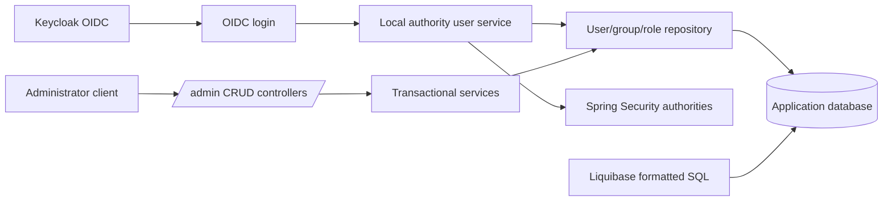

# Design: Local User Authorisation

## Overview

Keycloak remains the authentication and credential authority. On a successful OIDC
login, the application reads the token's `preferred_username`, finds the matching
enabled local user, collects the distinct roles granted by all of that user's
groups, and adds them as the sole Spring Security application authorities.

The application owns the local user, group, and role data; Spring MVC endpoints
under `/admin` manage it. JPA persists the model and Liquibase formatted SQL owns
both schema creation and deterministic test fixtures.

## Architecture



### Login flow

1. The existing `OidcUserService` obtains and validates the OIDC user as it does
   today.
2. A local-authority service reads the mandatory `preferred_username` claim from
   the ID token and looks up the local user with all group roles in one query.
3. A missing, disabled, or unreadable local user causes authentication to fail.
4. The service retains the standard OIDC-user authority, adds a distinct set of
   local `ROLE_<role-name>` authorities, and does not translate Keycloak realm or
   client roles into application authorities.
5. At the next login, the lookup reads current memberships and roles; no local
   authority cache is used in this feature.

## Decisions

### Identity mapping

The local `username` matches `preferred_username`, not the Keycloak `sub`.
Keycloak must enforce unique, immutable usernames. The local username is immutable
through the administration API; a Keycloak rename requires a coordinated migration
outside this feature.

### Role representation

Persist role names without a `ROLE_` prefix: `USER_MANAGE`, `GROUP_MANAGE`,
`ROLE_MANAGE`, and `APPLICATION_USER`. The authority service adds the prefix once.
Each management role grants all CRUD operations for its resource type. An
administrator receives the three management roles through the `Administrators`
group, not via a direct user-role assignment.

### Pagination

List endpoints use only offset pagination through Spring Data `Pageable`. This
feature exposes zero-based `page`, `size`, and `sort`; it does not expose cursor
or keyset pagination. Sort properties are whitelisted per resource.

### Portable migrations

Liquibase is the only schema owner; Hibernate DDL generation is disabled. The
Liquibase master changelog includes ordered formatted-SQL schema and seed
changesets. IDs are UUID strings generated by Java and supplied as fixed literals
for seed data. DDL uses portable `CHAR(36)`, `VARCHAR`, `BOOLEAN`, `TIMESTAMP`,
primary/foreign keys, unique constraints, and indexes. It uses no generated-ID,
UUID-function, JSON, or upsert syntax.

## Components and interfaces

| Component | Responsibilities |
|---|---|
| `domain.user`, `domain.group`, `domain.role` | JPA entities, repositories, and relationship queries |
| Administration services | Transactional validation, CRUD, filtering, pagination, DTO mapping, and domain exceptions |
| `/admin` controllers | Request validation, resource HTTP semantics, and pageable responses |
| `LocalAuthoritiesOidcUserService` | OIDC delegation, local-user lookup, fail-closed access decision, authority merge |
| `WebSecurityConfiguration` | Registers local OIDC service and guards endpoint families by management role |
| Liquibase changelogs | Portable schema and seed fixtures |

### Package and persistence design

```text
com.example.app.web.server
├── api.admin
│   ├── UserAdminController, GroupAdminController, RoleAdminController
│   └── request/response DTOs and PageResponse
├── domain
│   ├── user/AppUser, AppUserRepository
│   ├── group/AppGroup, AppGroupRepository
│   └── role/AppRole, AppRoleRepository
├── service
│   ├── UserAdministrationService
│   ├── GroupAdministrationService
│   └── RoleAdministrationService
└── security/LocalAuthoritiesOidcUserService
```

## Data model

| Table / entity | Columns | Relationships and constraints |
|---|---|---|
| `app_user` / `AppUser` | `id`, `username`, `display_name`, `email`, `enabled`, `created_at`, `updated_at` | primary key; `username` unique and not null; display name, enabled, and timestamps not null |
| `app_group` / `AppGroup` | `id`, `name`, `created_at`, `updated_at` | primary key; name unique and not null |
| `app_role` / `AppRole` | `id`, `name`, `created_at`, `updated_at` | primary key; name unique and not null |
| `app_user_group` | `user_id`, `group_id` | composite primary key; both foreign keys; a user requires at least one link at service level |
| `app_group_role` | `group_id`, `role_id` | composite primary key; both foreign keys |

`email` is nullable. `created_at` and `updated_at` are assigned by the
application, rather than a database-specific default. Entity associations are
many-to-many in both directions but API DTOs prevent recursive serialization.

The user-to-group requirement is enforced transactionally: create/update validates
that `groupIds` is non-empty; group deletion checks for membership before deletion.

### Bean Validation boundary

Bean Validation is applied in two places, with shared rules:

- **JPA entities:** annotate persistent fields and collections so invalid state
  cannot be written by any application path. Examples include `@NotBlank` and
  `@Size` on username, display name, and names; `@Email` on a supplied email; and
  `@NotEmpty` on a user's groups.
- **Request DTOs:** apply the same constraints to request fields and mark
  controller `@RequestBody` parameters with `@Valid`. This is what turns invalid
  HTTP input into a `400 ProblemDetail` before service logic runs.
- **Shared constraints:** define reusable composed constraints such as
  `@Username`, `@DisplayName`, and `@ResourceName` in a validation package. Use
  them on both entity and DTO properties. Common length limits live in public
  constants used by the composed annotations; no request DTO is mapped directly
  to a JPA entity.

DTOs remain necessary: accepting entities in controllers would expose persistence
associations to over-posting, make immutable fields difficult to protect, and
couple the external contract to JPA serialization. Bean Validation cannot check
whether a referenced group/role exists or a name is unique; services perform those
database-backed checks and return `404` or `409`.

## REST API

All endpoints require authentication. Management authority is checked at the
endpoint family:

| Endpoint | Authority |
|---|---|
| `/admin/users/**` | `ROLE_USER_MANAGE` |
| `/admin/groups/**` | `ROLE_GROUP_MANAGE` |
| `/admin/roles/**` | `ROLE_ROLE_MANAGE` |

| Resource | Operations |
|---|---|
| `/admin/users` | `POST`, `GET`; `/admin/users/{id}`: `GET`, `PUT`, `DELETE` |
| `/admin/groups` | `POST`, `GET`; `/admin/groups/{id}`: `GET`, `PUT`, `DELETE` |
| `/admin/roles` | `POST`, `GET`; `/admin/roles/{id}`: `GET`, `PUT`, `DELETE` |

`POST` returns `201 Created` with `Location`; `PUT` returns `200 OK`; `DELETE`
returns `204 No Content`. Requests and responses use UUID string IDs.

### DTOs

| Request | Fields |
|---|---|
| `CreateUserRequest` | `username`, `displayName`, optional `email`, `enabled`, non-empty `groupIds` |
| `UpdateUserRequest` | `displayName`, optional `email`, `enabled`, non-empty `groupIds` |
| `GroupRequest` | `name`, `roleIds` (empty allowed) |
| `RoleRequest` | `name` |

User `username` is deliberately absent from `UpdateUserRequest`. Resource
responses include full group/role summaries where required, but never expose JPA
entities directly.

Controllers use class-level `@Validated` to validate query parameters. `page` is
`@Min(0)`, `size` is `@Min(1) @Max(100)`, and `sort`/filter parameters are checked
against their supported field sets before repository queries execute.

### List contract

All list resources accept `page`, `size`, and `sort=property,(asc|desc)`. Defaults
are `page=0`, `size=20`, and ascending username/name. `size` must be 1–100.
Responses use:

```json
{
  "items": [],
  "page": 0,
  "size": 20,
  "totalItems": 0,
  "totalPages": 0
}
```

Allowed filter and sort fields are deliberately finite:

| Resource | Filters | Sort fields |
|---|---|---|
| Users | `username`, `displayName`, `enabled`, `groupId` | `username`, `displayName`, `createdAt`, `updatedAt` |
| Groups | `name`, `roleId` | `name`, `createdAt`, `updatedAt` |
| Roles | `name` | `name`, `createdAt`, `updatedAt` |

Name filters perform case-insensitive contains matching. An invalid filter or sort
property returns `400`.

## Security configuration

The broad existing authenticated rule remains. More-specific `/admin/users/**`,
`/admin/groups/**`, and `/admin/roles/**` matchers precede it and use `hasRole`
with unprefixed names (`USER_MANAGE`, `GROUP_MANAGE`, `ROLE_MANAGE`). The custom
OIDC service delegates only to load the standard OIDC user, then adds local roles.
It removes the current Keycloak realm-role mapping: application management and user
roles are sourced exclusively from the local database. It rejects a missing
`preferred_username`, unknown user, disabled user, or local lookup failure with an
OAuth2 authentication failure.

## Initial fixtures

Liquibase seeds the four roles and two groups. `Administrators` holds all three
management roles. `Test Users` holds `APPLICATION_USER`. It also seeds local users
`admin`, `test-user`, and `multi-group-user`; the first has the Administrators
membership, the second Test Users membership, and the third both. A new
`bin/seed-test-data.js` script creates matching immutable Keycloak
`preferred_username` accounts with the test-only password `password` and no
Keycloak realm or client roles. It does not alter `bin/configure-keycloak.js`.

## Error handling

| Situation | HTTP/result | Handling |
|---|---|---|
| Invalid body, query parameter, or page size | `400 ProblemDetail` | Validate before service operation |
| Missing user/group/role or referenced ID | `404 ProblemDetail` | Domain not-found exception |
| Duplicate username/name | `409 ProblemDetail` | Domain conflict exception |
| Delete populated group or assigned role | `409 ProblemDetail` | Pre-delete relationship check |
| Missing management authority | `403` | Spring Security access-denied handling |
| Unknown/disabled local user at login | Authentication failure | Do not create a session |
| Persistence/authority lookup failure at login | Authentication failure | Log securely and fail closed |
| Unexpected request failure | `500 ProblemDetail` | Existing logged catch-all handler |

The exception advice gains explicit handlers for validation, not-found, and
conflict exceptions before its existing generic handler. It must not disclose SQL
or database implementation detail.

### Validation-problem format

`ApiResponseEntityExceptionHandler` converts request-body Bean Validation failures
and invalid controller query parameters into `400 ProblemDetail` responses. It
adds an `errors` extension containing a list of field-level error objects:

```json
{
  "type": "about:blank",
  "title": "Validation failed",
  "status": 400,
  "detail": "One or more fields are invalid.",
  "errors": [
    {
      "code": "NotBlank",
      "message": "Display name is required.",
      "source": { "pointer": "/displayName" }
    },
    {
      "code": "InvalidCombination",
      "message": "The supplied values cannot be used together."
    }
  ]
}
```

The advice handles DTO `@Valid` failures, method/query-parameter validation
failures, and malformed JSON as distinct `400` cases. It returns stable field
paths, validation codes, and safe messages only. `source.pointer` is a JSON Pointer
to the request member (for example `/displayName`, `/groupIds`, or `/groupIds/0`),
so a frontend can attach the message to that input. An error without
`source.pointer` is a global form error when the violation cannot honestly be
attributed to one field. Rejected values, entity class names, stack traces, SQL
errors, and database details are never returned. Database existence and uniqueness
violations remain service-level `404` and `409` errors.

## Testing strategy

- **Liquibase integration:** Start an empty H2 test database, apply schema/seed
  changesets, and assert tables, constraints, roles, groups, and fixtures.
- **JPA integration:** Verify unique constraints, many-to-many mapping, fetch of a
  user with all local roles, and deletion restrictions.
- **Service tests:** Validate non-empty memberships, immutable username, lookup and
  conflict behavior, role aggregation, filters, whitelisted sorts, and page bounds.
- **Bean Validation tests:** Verify the shared constraints on both entity and DTO
  types, controller `@Valid` failures, query-parameter bounds, and that service
  existence/uniqueness checks remain distinct from syntactic validation.
- **MockMvc integration:** Cover each CRUD operation, pagination metadata,
  filtering, problem details, and endpoint-family authority rules.
- **Security tests:** Cover matching enabled user, unknown user, disabled user,
  missing claim, duplicate role aggregation, and database failure during login.
- **Regression:** Run the full Maven test suite and formatter.

## Requirement traceability

| Requirements | Design coverage |
|---|---|
| R1 | Identity mapping, `AppUser`, lifecycle DTOs, login failure path |
| R2 | `AppGroup`, `app_user_group`, deletion guard |
| R3 | `AppRole`, `app_group_role`, management security rules |
| R4 | Local authority service and login flow |
| R5 | REST API, list contract, exception mapping |
| R6 | Liquibase design and fixture plan |
