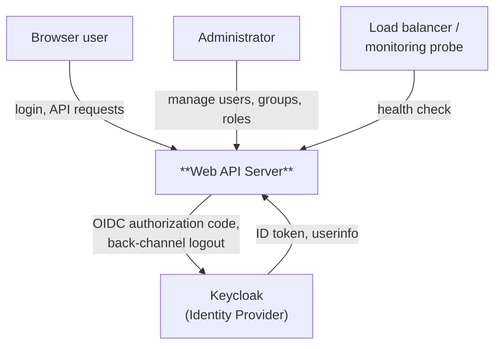
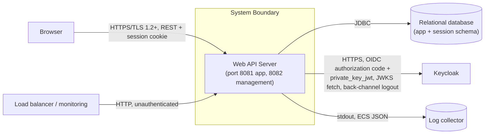

# 3. Context and Scope

## 3.1 Business Context

<!-- arc42-generated -->

| Communication Partner | Input | Output |
| --- | --- | --- |
| Browser user | Credentials (via Keycloak's login UI, not directly to this application), API requests | Session cookie, JSON responses, RFC 9457 Problem Details on error |
| Administrator (a browser user with management roles) | Create/update/disable requests for users, groups, roles under `/admin/**` | Paged JSON representations, `201 Created` with `Location`, `409 Conflict` on name collisions |
| Keycloak (identity provider) | ID token, userinfo claims, JWKS for token verification, back-channel logout tokens | Authorization code exchange (`private_key_jwt`-authenticated), account API calls proxied via `AccountController` |
| Load balancer / monitoring probe | Health check request to the management port | `200`/`503` from `/app/health`, no other detail (`show-details: never`) |
<!-- /arc42-generated -->

## 3.2 Technical Context

<!-- arc42-generated -->

| Interface | Protocol | Format | Notes |
| --- | --- | --- | --- |
| Browser to application | HTTPS (TLS 1.2/1.3 in production; plain HTTP in the `local` Maven profile) | HTML (default login page), JSON, `application/problem+json` on error | Session identified by an `id` cookie (`http-only`, `same-site=lax`, `secure` outside `local`). |
| Application to database | JDBC | Relational (Liquibase-managed schema: `app_user`, `app_group`, `app_role`, join tables, Spring Session tables) | Concrete database product is a [deployment decision required](../CONTEXT.md); `com.h2database:h2` is used for local development and tests only. |
| Application to Keycloak | HTTPS, OpenID Connect (authorization code grant, `private_key_jwt` client auth, back-channel logout) | JWT (ID token), JSON (userinfo, JWKS) | `spring.security.oauth2.client.provider.keycloak.issuer-uri` is `http://localhost:8080/realms/test` for local development; production issuer is a deployment decision required. |
| Application to Keycloak account API | HTTPS, bearer token via `RestClient` | JSON | Proxied through `GET /account` (`AccountController`), using the same OAuth2-authorized client as login. |
| Load balancer / monitoring to application | HTTP | Plain text/JSON (Actuator health) | Separate management port (`8082`), base path `/app` (not the `/actuator` default), unauthenticated only for `/app/health`; see [ADR 0014](../adr/0014-actuator-management-port.md). |
| Application to log collector | stdout | ECS-structured JSON | No network log shipping is configured by the application itself; collection is a deployment responsibility. See [Logging](08-crosscutting-concepts/logging/README.md). |
<!-- /arc42-generated -->
