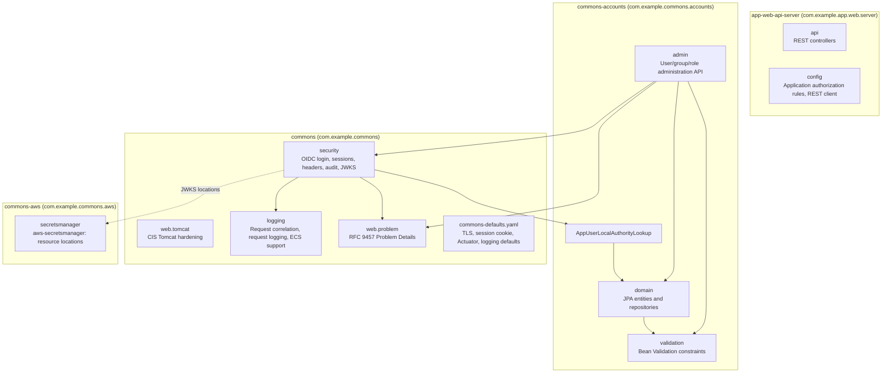
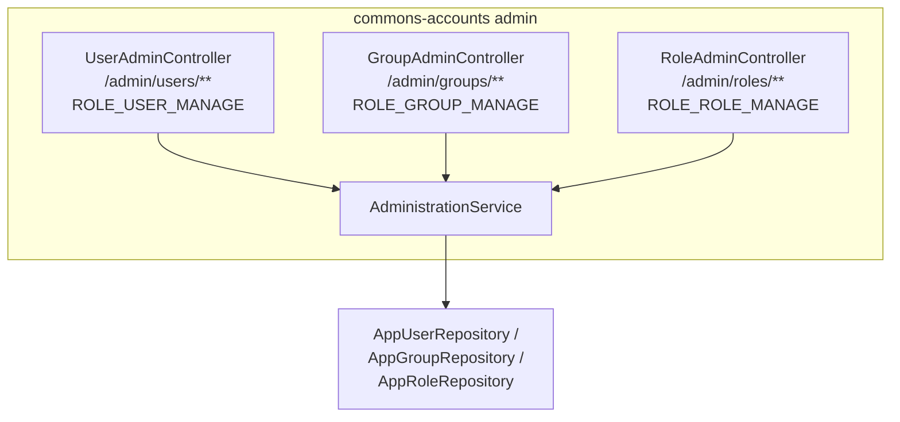
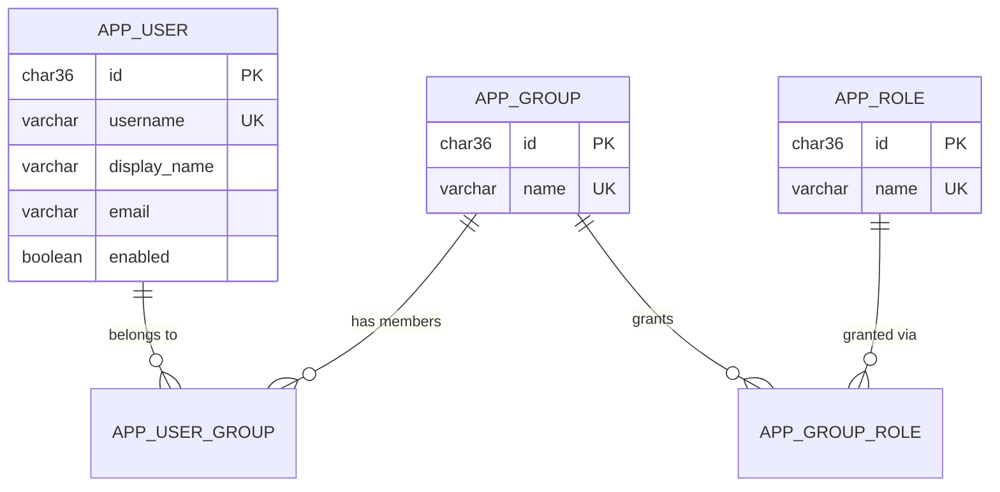

# 5. Building Block View

## 5.1 Whitebox Overall System (Level 1)

<!-- arc42-generated -->

**Motivation:** The repository is a Maven multi-module build
([ADR 0019](../adr/0019-shared-commons-auto-configuration.md)). `commons` is
the shared, secure-by-default baseline every backend depends on: it applies
itself through Spring Boot auto-configuration, so an application gets the
security filter chain baseline, the Tomcat hardening, the request logging
filters, Problem Details error handling, and the configuration defaults
without wiring any of it. It reaches a user model only through the
`LocalAuthorityLookup` interface. `commons-accounts` is the optional user,
group, and role model that implements it, with its administration API; a
backend that reads a user store another backend owns can implement the
interface itself instead. `commons-aws` is the optional AWS integration: it lets
a resource location, such as a JWKS location, name an AWS Secrets Manager secret
([ADR 0020](../adr/0020-jwks-rotation-from-aws-secrets-manager.md)); `commons`
does not depend on it. `app-web-api-server` is the reference backend and
holds only what is specific to it: its own endpoints, its authorization
rules, its Liquibase master changelog, and its configuration.

### Contained Building Blocks

| Building Block | Responsibility | Interfaces | Code Location |
| --- | --- | --- | --- |
| `commons` `security` | Security filter chain baseline: security headers, session management (absolute timeout, one session per user), method security, security audit events; OIDC login with local authorities and OIDC back-channel and RP-initiated logout, added when the OAuth2 client is on the classpath | `WebSecurityAutoConfiguration`, `OidcLoginSecurityAutoConfiguration`, `WebSecurityProperties` (`commons.security.*`), `SecurityAuditEventLogger`; `commons.security.enabled` | `commons/src/main/java/com/example/commons/security/` |
| `commons` `security.authentication` | Converts Spring Security authentication failures into RFC 9457 Problem Details; local-authority-aware OIDC user loading | `ProblemDetailAuthenticationEntryPoint`, `LocalAuthoritiesOidcUserService` | `commons/src/main/java/com/example/commons/security/authentication/` |
| `commons` `security.authorization` | The source of local authorities; per-request local authority refresh; RFC 9457 access-denied responses | `LocalAuthorityLookup`, `LocalAuthorityRefreshFilter`, `ProblemDetailAccessDeniedHandler` | `commons/src/main/java/com/example/commons/security/authorization/` |
| `commons` `security.session` | Session lifecycle: absolute timeout, concurrent-session eviction, audit logging, revocation on authority change | `AbsoluteSessionTimeoutFilter`, `SessionLifecycleAuditLogger`, `SessionRevocationService`, `SessionLifecycleAuditInitializationFilter` | `commons/src/main/java/com/example/commons/security/session/` |
| `commons` `security.firewall` | RFC 9457 response for requests Spring Security's `HttpFirewall` rejects | `ProblemDetailRequestRejectedHandler` | `commons/src/main/java/com/example/commons/security/firewall/` |
| `commons` `security.oauth2` | `private_key_jwt` client authentication, the private JWKS read again on a schedule, JWKS publication, and ID token decryption, applied only when a client registration uses `private_key_jwt` | `PrivateKeyJwtAutoConfiguration`, `JwksProperties` (`commons.security.oauth2.jwks`, `commons.security.oauth2.jwks-refresh-interval`), `RefreshingJwks`, `JwksHealthIndicator` (`jwks` in the readiness group), `IdTokenDecryption`, `GET /oauth2/jwks` | `commons/src/main/java/com/example/commons/security/oauth2/` |
| `commons` `web.tomcat` | CIS Tomcat hardening of the embedded server, Tomcat-level Problem Details error reports, strict servlet compliance | `TomcatHardeningAutoConfiguration`, `TomcatApplicationContextInitializer`; `commons.web.tomcat.enabled` | `commons/src/main/java/com/example/commons/web/tomcat/` |
| `commons` `logging` | Request correlation, ECS/trace field customization, request-boundary logging, MDC cleanup, application lifecycle events | `LoggingAutoConfiguration` (registers `RequestCorrelationContextFilter` and `LoggingContextCleanupFilter`, and adds `AuthenticatedUserLoggingContextFilter` and `RequestLoggingFilter` to every security filter chain), `TraceCorrelationJsonMembersCustomizer`, `ApplicationLifecycleEventLogger`, `MdcTaskDecorator` (request MDC on async tasks); `commons.logging.enabled` | `commons/src/main/java/com/example/commons/logging/` |
| `commons` `logging.client` / `logging.request` | Pluggable client-IP and upstream-request-ID resolution (safe no-op defaults; an application defines its own bean for its ingress) | `ClientIpResolver`, `RequestIdResolver` | `commons/src/main/java/com/example/commons/logging/client/`, `.../logging/request/` |
| `commons` `web.problem` | RFC 9457 error handling for every endpoint, and the exceptions applications throw to produce it | `ProblemDetailsAutoConfiguration`, `ApiResponseEntityExceptionHandler`, `ProblemDetailErrorController`, `ProblemTypes`, `BadRequestException`, `ConflictException`, `ResourceNotFoundException`; `commons.web.problem-details.enabled` | `commons/src/main/java/com/example/commons/web/problem/` |
| `commons` defaults | Configuration defaults ranked below every application configuration source | `CommonsDefaultsEnvironmentPostProcessor` | `commons/src/main/resources/META-INF/commons-defaults.yaml` |
| `commons-aws` `secretsmanager` | Resolves `aws-secretsmanager:<secret name or ARN>` resource locations to the secret's `AWSCURRENT` value, read with Spring Cloud AWS's `SecretsManagerClient` | `SecretsManagerResourceAutoConfiguration`, `SecretsManagerProtocolResolver`, `SecretsManagerResource`; `spring.cloud.aws.*` | `commons-aws/src/main/java/com/example/commons/aws/secretsmanager/` |
| `commons-accounts` | Local account management wiring: registers the model, the authority lookup, and the administration API | `AccountsAutoConfiguration`, `AppUserLocalAuthorityLookup`; `commons.accounts.enabled`, `commons.accounts.admin.enabled` | `commons-accounts/src/main/java/com/example/commons/accounts/` |
| `commons-accounts` `admin` | Administration REST API for users, groups, and roles | `/admin/users/**`, `/admin/groups/**`, `/admin/roles/**` (each individually role-gated) | `commons-accounts/src/main/java/com/example/commons/accounts/admin/` |
| `commons-accounts` `domain` | JPA entities (`AppUser`, `AppGroup`, `AppRole`) and Spring Data repositories | Repository interfaces consumed by `admin` and `AppUserLocalAuthorityLookup` | `commons-accounts/src/main/java/com/example/commons/accounts/domain/` |
| `commons-accounts` `validation` | Reusable Bean Validation constraints for account input | `@Username`, `@DisplayName`, `@ResourceName` | `commons-accounts/src/main/java/com/example/commons/accounts/validation/` |
| `api` | Public, non-administrative REST endpoints: caller's local identity and roles, Keycloak account proxy | `GET /login-user`, `GET /account` | `app-web-api-server/src/main/java/com/example/app/web/server/api/` |
| `config` | Spring `@Configuration` classes: the application's authorization rules, REST client | `WebSecurityConfiguration`; otherwise wiring only | `app-web-api-server/src/main/java/com/example/app/web/server/config/` |

Full detail on the security and logging crosscutting behavior is documented
once, not duplicated here: see
[Security](08-crosscutting-concepts/02-security-and-authentication/README.md) and
[Logging](08-crosscutting-concepts/06-logging-and-monitoring/README.md).
<!-- /arc42-generated -->

## 5.2 Level 2

<!-- arc42-generated -->
### Administration API (White Box)

| Component | Responsibility |
| --- | --- |
| `UserAdminController` / `GroupAdminController` / `RoleAdminController` | Thin REST controllers; each is annotated `@PreAuthorize` (or matched in the security filter chain) with a distinct management authority, so a caller with only `USER_MANAGE` cannot administer groups or roles. Roles can be created and deleted but not renamed; `UserAdminController` also ends one user's or every user's sessions. |
| `AdminReauthenticationInterceptor` | Rejects a change from a login older than 15 minutes with a `reauthentication-required` problem (see [ADR 0023](../adr/0023-recent-login-for-administration-changes.md)). |
| `AdministrationService` | Application-layer orchestration for create/update/list/disable operations; translates domain conflicts (duplicate name) into `ConflictException`, missing resources into `ResourceNotFoundException`, and keeps an administrator from granting more than they hold (see [ADR 0022](../adr/0022-administrators-cannot-grant-beyond-their-own-roles.md)). |
| `AdministrationAuditLogger` | Logs every change, after commit, and every rejected change as an ECS `iam` event with the prior state, the changes, and the roles and groups granted or withdrawn (see [ADR 0021](../adr/0021-authorisation-change-audit-log-events.md)). |
| `AdminDtos` | Request/response DTOs, including `PageResponse` for paginated listings. |

### Passkeys (White Box)

Present only when `commons.security.passkeys.enabled` is set (see
[ADR 0024](../adr/0024-passkey-login-bound-to-local-user.md)). Spring Security's
`webauthn()` support supplies the login and registration endpoints and the
credential storage; these components fit it to the local user model.

| Component | Responsibility |
| --- | --- |
| `PasskeySecurityAutoConfiguration` | Adds the WebAuthn configuration to every filter chain behind the opt-in property, and fails startup without a relying party ID and allowed origins. The policy is discoverable credentials, required user verification, and no attestation. |
| `PasskeyUserDirectory` (`AppUserPasskeyUserDirectory` in commons-accounts) | Finds the enabled local user for a username; the user's UUID is the WebAuthn user handle. |
| `DirectoryBackedUserEntityRepository` | Stores the passkey user entity of a directory user only, so Spring never creates a random handle. |
| `AuditedUserCredentialRepository` | Limits passkeys per user, refuses a login whose signature counter did not increase, and records each registration and removal through `PasskeyAuditLogger`. |
| `PasskeyRegistrationGuardFilter` | Requires authentication, a recent login, and room under the per-user limit before a passkey can be registered. |
| `PasskeyLocalAuthorityRefresher` | Lets `LocalAuthorityRefreshFilter` reload the local roles of a passkey session, and end it when the local user is disabled or deleted. |
| `PasskeySessionFilters` | Records the time of a passkey login for the recent-login checks, and ends a passkey session at its own absolute timeout. |
| `PasskeyManager` (`PasskeyController`, `UserPasskeyAdminController`) | Lists, renames, and revokes passkeys for the user and for an administrator, and removes them when a user is deleted. |

### Domain Model

Users are assigned to groups, and groups are granted roles; a user's
effective authorities are the union of the roles of all of their groups.
There is no direct user-to-role assignment. All three entities extend
`AbstractAuditableEntity` (`created_at`/`updated_at`, and `created_by`/`updated_by`
holding the authenticated actor or `system`); the history of changes is the
administration audit log, not these columns. The Keycloak
`preferred_username` claim is matched against `app_user.username`, which
is why usernames are treated as immutable once a user is provisioned (see
`README.md`). The schema is in
`commons-accounts/src/main/resources/db/changelog/001-authorisation-schema.sql`,
Spring Session's own tables are in commons' `003-spring-session-schema.sql`, the OIDC session registry's table is in commons' `005-oidc-session-registry.sql`, and the
passkey tables Spring Security's WebAuthn support expects (`user_entities` and
`user_credentials`, used only when passkeys are enabled) are in
`commons-accounts`' `006-passkey-schema.sql`, with no foreign key from
`user_entities` to `app_user` because the user handle is the UUID's bytes, so
deleting a user deletes their passkeys in code: modules ship schema, applications ship data. The application seeds the roles
and the `Administrators` group in its own `002-authorisation-seed.sql`, including
the `USER_MANAGE`, `GROUP_MANAGE`, and `ROLE_MANAGE` roles the administration
API requires by name. Each changelog keeps its original `db/changelog/`
classpath path, and the application's master changelog includes them in order.
The development and test users are in the application's
`004-development-seed.sql`, applied only when the `dev` Liquibase context is requested
([ADR 0018](../adr/0018-development-fixtures-kept-out-of-production.md)).

### Security Filter Chain (White Box)

```mermaid
flowchart LR
    RequestCorrelation["RequestCorrelationContextFilter\n(order: HIGHEST_PRECEDENCE+10,\nahead of Security filter chain)"] --> SecurityChain
    subgraph SecurityChain ["Security filter chain"]
        direction LR
        AuthLogging["AuthenticatedUserLoggingContextFilter"] --> AuditInit["SessionLifecycleAuditInitializationFilter"]
        AuditInit --> AbsTimeout["AbsoluteSessionTimeoutFilter"]
        AbsTimeout --> ReqLogging["RequestLoggingFilter"]
        ReqLogging --> AuthorityRefresh["LocalAuthorityRefreshFilter"]
        AuthorityRefresh --> AuthZ["Authorization rules\n(role/authority per path)"]
    end
    SecurityChain --> Cleanup["LoggingContextCleanupFilter\n(outermost, HIGHEST_PRECEDENCE)"]
```

The commons module assembles this chain through ordered
`Customizer<HttpSecurity>` beans that Spring Security applies before the
application's own `SecurityFilterChain` bean: `LoggingAutoConfiguration` adds
`AuthenticatedUserLoggingContextFilter` and `RequestLoggingFilter` (and registers
the two servlet filters outside the chain), then `WebSecurityAutoConfiguration`
adds the session filters next to them, and `OidcLoginSecurityAutoConfiguration` adds
the authority filter and OIDC login, anchored on Spring Security's own filters. The application's `WebSecurityConfiguration` adds only its
authorization rules. Filter order is deliberate and documented inline (see source references in
[ADR 0010](../adr/0010-ecs-structured-logging.md) and
[ADR 0012](../adr/0012-request-correlation-ahead-of-security-chain.md)).
<!-- /arc42-generated -->

## 5.3 Level 3

<!-- arc42-manual: Further decompose individual filters or services only if a future change makes one of them complex enough to warrant its own diagram (for example, if the local authority model grows beyond group-to-role mapping). -->
<!-- /arc42-manual -->
