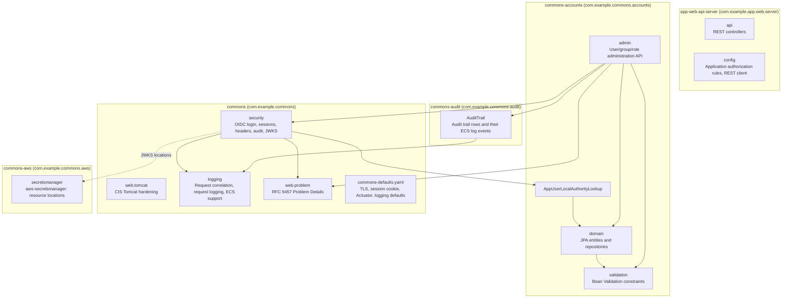
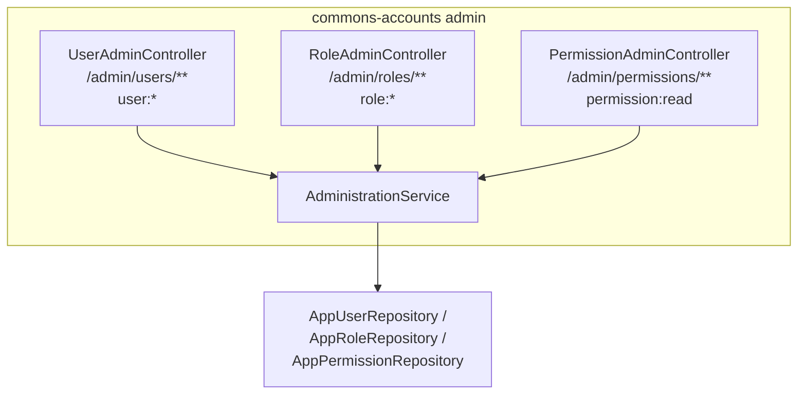
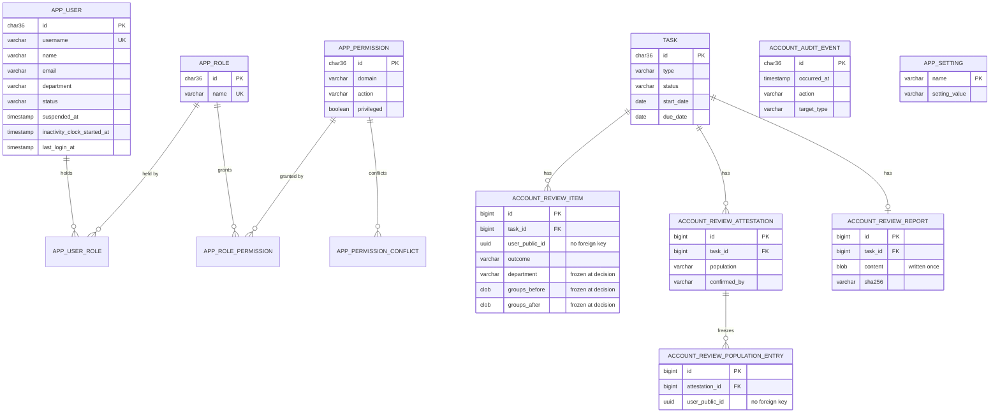

# 5. Building Block View

## 5.1 Whitebox Overall System (Level 1)

<!-- arc42-generated -->

**Motivation:** The repository is a Maven multi-module build
([ADR 0019](../adr/0019-shared-commons-auto-configuration.md)). `commons` is
the shared, secure-by-default baseline every backend depends on: it applies
itself through Spring Boot auto-configuration, so an application gets the
security filter chain baseline, the Tomcat hardening, the request logging
filters, Problem Details error handling, and the configuration defaults
without wiring any of it. It reaches a user model only through the
`LocalAuthorityLookup` interface. `commons-accounts` is the optional user,
role, and permission model that implements it, with its administration API; a
backend that reads a user store another backend owns can implement the
interface itself instead. `commons-audit` is the optional audit trail that
`commons-accounts` records every change in, as a table row and an ECS log event,
and that an application's own features can record theirs in
([ADR 0040](../adr/0040-generic-audit-trail-module.md)). `commons-aws` is the optional AWS integration: it lets
a resource location, such as a JWKS location, name an AWS Secrets Manager secret
([ADR 0020](../adr/0020-jwks-rotation-from-aws-secrets-manager.md)); `commons`
does not depend on it. `app-web-api-server` is the reference backend and
holds only what is specific to it: its own endpoints, its authorization
rules, its Liquibase master changelog, and its configuration.

### Contained Building Blocks

| Building Block | Responsibility | Interfaces | Code Location |
| --- | --- | --- | --- |
| `commons` `security` | Security filter chain baseline: security headers, session management (absolute timeout, one session per user), method security, security audit events; OIDC login with local authorities and OIDC back-channel and RP-initiated logout, added when the OAuth2 client is on the classpath | `WebSecurityAutoConfiguration`, `OidcLoginSecurityAutoConfiguration`, `WebSecurityProperties` (`commons.security.*`), `SecurityAuditEventLogger`; `commons.security.enabled` | `commons/src/main/java/com/example/commons/security/` |
| `commons` `security.authentication` | Converts Spring Security authentication failures into RFC 9457 Problem Details; local-authority-aware OIDC user loading | `ProblemDetailAuthenticationEntryPoint`, `LocalAuthoritiesOidcUserService` | `commons/src/main/java/com/example/commons/security/authentication/` |
| `commons` `security.authorization` | The source of local authorities; per-request local authority refresh; RFC 9457 access-denied responses | `LocalAuthorityLookup`, `LocalAuthorityRefreshFilter`, `ProblemDetailAccessDeniedHandler` | `commons/src/main/java/com/example/commons/security/authorization/` |
| `commons` `security.session` | Session lifecycle: absolute timeout, concurrent-session eviction, audit logging, revocation on authority change | `AbsoluteSessionTimeoutFilter`, `SessionLifecycleAuditLogger`, `SessionRevocationService`, `SessionLifecycleAuditInitializationFilter` | `commons/src/main/java/com/example/commons/security/session/` |
| `commons` `security.firewall` | RFC 9457 response for requests Spring Security's `HttpFirewall` rejects | `ProblemDetailRequestRejectedHandler` | `commons/src/main/java/com/example/commons/security/firewall/` |
| `commons` `security.oauth2` | `private_key_jwt` client authentication, the private JWKS read again on a schedule, JWKS publication, and ID token decryption, applied only when a client registration uses `private_key_jwt` | `PrivateKeyJwtAutoConfiguration`, `JwksProperties` (`commons.security.oauth2.jwks`, `commons.security.oauth2.jwks-refresh-interval`), `RefreshingJwks`, `JwksHealthIndicator` (`jwks` in the readiness group), `IdTokenDecryption`, `GET /oauth2/jwks` | `commons/src/main/java/com/example/commons/security/oauth2/` |
| `commons` `web.tomcat` | CIS Tomcat hardening of the embedded server, Tomcat-level Problem Details error reports, strict servlet compliance | `TomcatHardeningAutoConfiguration`, `TomcatApplicationContextInitializer`; `commons.web.tomcat.enabled` | `commons/src/main/java/com/example/commons/web/tomcat/` |
| `commons` `logging` | Request correlation, ECS/trace field customization, request-boundary logging, MDC cleanup, application lifecycle events | `LoggingAutoConfiguration` (registers `RequestCorrelationContextFilter` and `LoggingContextCleanupFilter`, and adds `AuthenticatedUserLoggingContextFilter` and `RequestLoggingFilter` to every security filter chain), `TraceCorrelationJsonMembersCustomizer`, `ApplicationLifecycleEventLogger`, `MdcTaskDecorator` (request MDC on async tasks); `commons.logging.enabled` | `commons/src/main/java/com/example/commons/logging/` |
| `commons` `logging.client` / `logging.request` | Pluggable client-IP and upstream-request-ID resolution (safe no-op defaults; an application defines its own bean for its ingress) | `ClientIpResolver`, `RequestIdResolver` | `commons/src/main/java/com/example/commons/logging/client/`, `.../logging/request/` |
| `commons` `web.problem` | RFC 9457 error handling for every endpoint, and the exceptions applications throw to produce it | `ProblemDetailsAutoConfiguration`, `ApiResponseEntityExceptionHandler`, `ProblemDetailErrorController`, `ProblemTypes`, `BadRequestException`, `ConflictException`, `ResourceNotFoundException`; `commons.web.problem-details.enabled` | `commons/src/main/java/com/example/commons/web/problem/` |
| `commons` defaults | Configuration defaults ranked below every application configuration source | `CommonsDefaultsEnvironmentPostProcessor` | `commons/src/main/resources/META-INF/commons-defaults.yaml` |
| `commons-aws` `secretsmanager` | Resolves `aws-secretsmanager:<secret name or ARN>` resource locations to the secret's `AWSCURRENT` value, read with the AWS SDK's `SecretsManagerClient` | `SecretsManagerResourceAutoConfiguration`, `SecretsManagerProtocolResolver`, `SecretsManagerResource`; the AWS SDK region and credentials chain | `commons-aws/src/main/java/com/example/commons/aws/secretsmanager/` |
| `commons-audit` | The audit trail: records every audited event as a row of `audit_event` and an ECS log event with the same `event.id`, keeps a refused change's row through the rollback of the request that attempted it, and reads the trail back | `AuditTrail` (`record`, `reject`, `find`, `search`), `AuditAction`, `AuditEvent`, `AuditRecord`, `Auditor`; `AuditAutoConfiguration` | `commons-audit/src/main/java/com/example/commons/audit/` |
| `commons-accounts` | Local account management wiring: registers the model, the authority lookup, and the administration API | `AccountsAutoConfiguration`, `AppUserLocalAuthorityLookup`; `commons.accounts.enabled`, `commons.accounts.admin.enabled` | `commons-accounts/src/main/java/com/example/commons/accounts/` |
| `commons-accounts` `admin` | Administration REST API for users, roles, and the read-only permissions, and the read-only audit trail | `/admin/users/**`, `/admin/roles/**`, `/admin/permissions/**` (each endpoint gated by the permission it needs, such as `user:create`), `/audit-events` (`audit:read`) | `commons-accounts/src/main/java/com/example/commons/accounts/admin/` |
| `commons-accounts` account lifecycle | Records each user's last sign-in (`LastLoginRecorder`); suspends, unsuspends, and removes accounts in one place (`AccountLifecycleService`); and suspends then removes inactive accounts according to the `inactivity.*` settings (`InactiveUserSuspender`, checked every `commons.accounts.inactivity.check-interval`) | `LastLoginRecorder`, `AccountLifecycleService`, `InactiveUserSuspender` | `commons-accounts/src/main/java/com/example/commons/accounts/` |
| `commons-accounts` `settings` | The application settings, read from the `app_setting` table and edited through the API by whoever holds the settings permissions | `SettingsService`, `/admin/settings` (`settings:read`, `settings:update`) | `commons-accounts/src/main/java/com/example/commons/accounts/settings/` |
| `commons-accounts` `review` | The periodic account reviews: creates a privileged and a non-privileged review task in each one's review month and completes tasks finished by outside changes (`AccountReviewScheduler`, `commons.accounts.review.check-interval`, `commons.accounts.review.time-zone`); lets reviewers confirm, remove roles from or remove active accounts and confirm the suspended and removed populations of the review's class, completing the task by itself (`AccountReviewService`); and stores the completion report and serves the downloads (`AccountReviewReports`, `ReviewReportRenderer`, see [ADR 0037](../adr/0037-account-review-populations-and-stored-report.md) and [ADR 0038](../adr/0038-role-permission-model-and-account-review-classes.md)) | `/tasks/**`, `/account-reviews/**` (`review:*`) | `commons-accounts/src/main/java/com/example/commons/accounts/review/` |
| `commons-accounts` `audit` | The account vocabulary of the audit trail: the user, role and session actions, the details each one keeps and its ECS fields, and the reads the account review needs (removals since a date, who suspended an account, removal reasons) | `AccountAudit` | `commons-accounts/src/main/java/com/example/commons/accounts/audit/` |
| `commons-accounts` `report` | A reusable PDF base on OpenPDF (`ReportDocument`): title block, key-value metadata, summary tiles, tables and page footers | `ReportDocument` | `commons-accounts/src/main/java/com/example/commons/accounts/report/` |
| `commons-accounts` `domain` | JPA entities (`AppUser`, `AppRole`, `AppPermission`, `AppSetting`, `Task`, `AccountReviewItem`, `AccountReviewAttestation`, `AccountReviewPopulationEntry`, `AccountReviewReport`) and Spring Data repositories | Repository interfaces consumed by `admin` and `AppUserLocalAuthorityLookup` | `commons-accounts/src/main/java/com/example/commons/accounts/domain/` |
| `commons-accounts` `validation` | Reusable Bean Validation constraints for account input | `@Username`, `@ResourceName` | `commons-accounts/src/main/java/com/example/commons/accounts/validation/` |
| `api` | Public, non-administrative REST endpoints: caller's local identity and permissions, Keycloak account proxy | `GET /login-user`, `GET /account` | `app-web-api-server/src/main/java/com/example/app/web/server/api/` |
| `config` | Spring `@Configuration` classes: the application's authorization rules, REST client | `WebSecurityConfiguration`; otherwise wiring only | `app-web-api-server/src/main/java/com/example/app/web/server/config/` |

Full detail on the security and logging crosscutting behavior is documented
once, not duplicated here: see
[Security](08-crosscutting-concepts/02-security-and-authentication/README.md) and
[Logging](08-crosscutting-concepts/06-logging-and-monitoring/README.md).
<!-- /arc42-generated -->

## 5.2 Level 2

<!-- arc42-generated -->
### Administration API (White Box)

| Component | Responsibility |
| --- | --- |
| `UserAdminController` / `RoleAdminController` / `PermissionAdminController` | Thin REST controllers; each method is annotated `@PreAuthorize` with the permission it needs, so a caller with only `user:read` cannot create a user or touch a role. Roles can be created, renamed and deleted, and permissions can only be read; `UserAdminController` also ends one user's or every user's sessions. |
| `AdminReauthenticationInterceptor` | Rejects a change from a login older than 15 minutes with a `reauthentication-required` problem that names the session's login method and, for OpenID Connect, the URI to log in again at (`ReauthenticationChallenge`; see [ADR 0023](../adr/0023-recent-login-for-administration-changes.md)). |
| `AccountLifecycleService` | Suspends, unsuspends, and removes accounts for the administration API, the account review, and the inactivity job, so each applies the same rules: a reason is required, sessions are ended, removal deletes the account with its role memberships and passkeys in one transaction, and an authenticated actor cannot change their own account (see [ADR 0031](../adr/0031-inactive-account-suspension-and-removal.md)). |
| `AdministrationService` | Application-layer orchestration for create/update/list operations; translates domain conflicts (duplicate name) into `ConflictException`, missing resources into `ResourceNotFoundException`, checks the permission each change needs, keeps an actor from granting a privileged permission they do not hold, and keeps conflicting permissions apart (see [ADR 0038](../adr/0038-role-permission-model-and-account-review-classes.md)). |
| `AccountAudit` | Records every change, and every refused change under the action it attempted, in the audit trail, with the prior state, the changes, and the roles and permissions granted or withdrawn (see [ADR 0021](../adr/0021-authorisation-change-audit-log-events.md) and [ADR 0040](../adr/0040-generic-audit-trail-module.md)). |
| `AdminDtos` | Request/response DTOs, including `PageResponse` for paginated listings. |

### Passkeys (White Box)

Present only when `commons.security.passkeys.enabled` is set (see
[ADR 0024](../adr/0024-passkey-login-bound-to-local-user.md)). Spring Security's
`webauthn()` support supplies the login and registration endpoints and the
credential storage; these components fit it to the local user model.

| Component | Responsibility |
| --- | --- |
| `PasskeySecurityAutoConfiguration` | Adds the WebAuthn configuration to every filter chain behind the opt-in property, and fails startup without a relying party ID and allowed origins. The policy is discoverable credentials, required user verification, and no attestation. |
| `PasskeyUserDirectory` (`AppUserPasskeyUserDirectory` in commons-accounts) | Finds the active local user for a username; the user's UUID is the WebAuthn user handle. |
| `DirectoryBackedUserEntityRepository` | Stores the passkey user entity of a directory user only, so Spring never creates a random handle. |
| `AuditedUserCredentialRepository` | Limits passkeys per user, refuses a login whose signature counter did not increase, and records each registration and removal through `PasskeyAuditLogger`. |
| `PasskeyRegistrationGuardFilter` | Requires authentication, a recent login, and room under the per-user limit before a passkey can be registered. |
| `PasskeyLocalAuthorityRefresher` | Lets `LocalAuthorityRefreshFilter` reload the local authorities of a passkey session, and end it when the local user is suspended or removed. |
| `PasskeySessionFilters` | Records the time of a passkey login for the recent-login checks, and ends a passkey session at its own absolute timeout. |
| `PasskeyManager` (`PasskeyController`, `UserPasskeyAdminController`) | Lists, renames, and revokes passkeys for the user and for an administrator, and removes them when a user is deleted. |

### Domain Model

Users hold roles, and roles hold permissions; a user's effective authorities are
the union of the permissions of all of their roles, each named `domain:action`
(see [ADR 0038](../adr/0038-role-permission-model-and-account-review-classes.md)). A
permission is reference data that the schema seeds, with a `privileged` flag, and
`app_permission_conflict` lists the pairs that no user may hold together. A user is
privileged when any of their roles holds a privileged permission; that is computed,
not stored. `AppUser` and `AppRole` extend
`AbstractAuditableEntity` (`created_at`/`updated_at`, and `created_by`/`updated_by`
holding the authenticated actor or `system`); the history of changes is the
administration audit log, not these columns. The Keycloak
`preferred_username` claim, which the provider registration's
`user-name-attribute` names, is matched against `app_user.username`, which
is why usernames are treated as immutable once a user is provisioned (see
`README.md`). Each module ships its tables as a Liquibase changelog and as plain SQL
for H2, PostgreSQL and SQL Server ([ADR 0035](../adr/0035-module-schemas-as-changelog-and-sql.md)):
`commons-accounts` in `com/example/commons/accounts/jdbc` (users, roles and permissions, the
passkey tables Spring Security's WebAuthn support expects, the account status and
inactivity clock, the settings, and the task and review tables), `commons-audit` in
`com/example/commons/audit/jdbc` (the audit trail table) and
`commons` in `com/example/commons/session/jdbc` (Spring Session's tables) and `com/example/commons/session/oidc/jdbc` (the OIDC
session registry's table). Modules ship schema, applications ship data. There is no
foreign key from `user_entities` to `app_user` because the passkey user handle is the
public UUID's bytes, so deleting a user deletes their passkeys in code. `account_review_item`, `account_review_population_entry` and
`audit_event` hold the user's public ID and username with no foreign key to `app_user`,
so they outlive a removed account. A pending review item is read from the live account;
the evidence columns of a decided item, a confirmed population's entries and the stored
report are written once and never change ([ADR 0037](../adr/0037-account-review-populations-and-stored-report.md)). The application's own changelog, `db/changelog` in
`app-web-api-server`, includes the two schemas, which seed the permissions, and then seeds
the `Administrators` and `Account Reviewers` roles and what they grant in
`reference-data.sql`. The development and test users are in `development-seed.sql`,
applied only when the `dev` Liquibase context is requested
([ADR 0018](../adr/0018-development-fixtures-kept-out-of-production.md)).

### Security Filter Chain (White Box)

```mermaid
flowchart LR
    RequestCorrelation["RequestCorrelationContextFilter\n(order: HIGHEST_PRECEDENCE+10,\nahead of Security filter chain)"] --> SecurityChain
    subgraph SecurityChain ["Security filter chain"]
        direction LR
        AuthLogging["AuthenticatedUserLoggingContextFilter"] --> AuditInit["SessionLifecycleAuditInitializationFilter"]
        AuditInit --> AbsTimeout["AbsoluteSessionTimeoutFilter"]
        AbsTimeout --> ReqLogging["RequestLoggingFilter"]
        ReqLogging --> AuthorityRefresh["LocalAuthorityRefreshFilter"]
        AuthorityRefresh --> AuthZ["Authorization rules\n(permission per endpoint)"]
    end
    SecurityChain --> Cleanup["LoggingContextCleanupFilter\n(outermost, HIGHEST_PRECEDENCE)"]
```

The commons module assembles this chain through ordered
`Customizer<HttpSecurity>` beans that Spring Security applies before the
application's own `SecurityFilterChain` bean: `LoggingAutoConfiguration` adds
`AuthenticatedUserLoggingContextFilter` and `RequestLoggingFilter` (and registers
the two servlet filters outside the chain), then `WebSecurityAutoConfiguration`
adds the session filters next to them, and `OidcLoginSecurityAutoConfiguration` adds
the authority filter and OIDC login, anchored on Spring Security's own filters. The application's `WebSecurityConfiguration` adds only its
authorization rules. Filter order is deliberate and documented inline (see source references in
[ADR 0010](../adr/0010-ecs-structured-logging.md) and
[ADR 0012](../adr/0012-request-correlation-ahead-of-security-chain.md)).
<!-- /arc42-generated -->

## 5.3 Level 3

<!-- arc42-manual: Further decompose individual filters or services only if a future change makes one of them complex enough to warrant its own diagram (for example, if the local authority model grows beyond group-to-role mapping). -->
<!-- /arc42-manual -->
