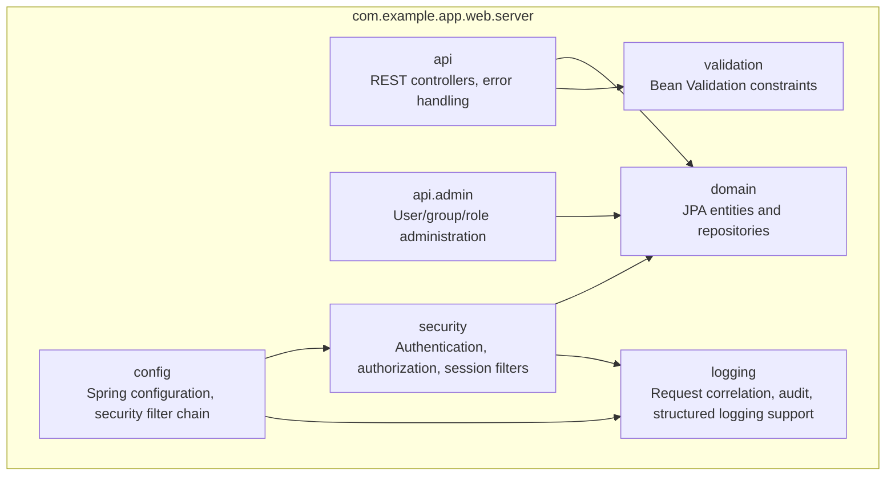
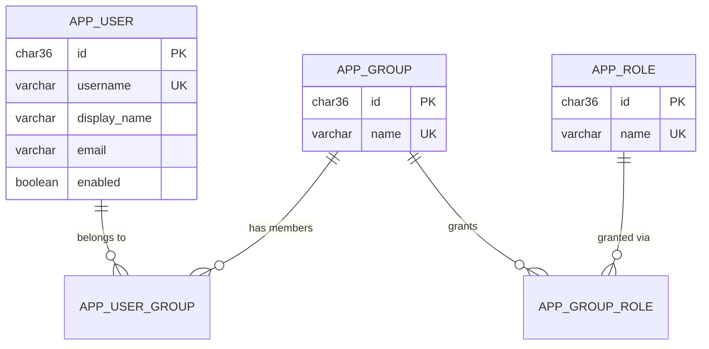

# 5. Building Block View

## 5.1 Whitebox Overall System (Level 1)

<!-- arc42-generated -->

**Motivation:** The codebase is a single deployable unit organized by
technical concern rather than by feature module, appropriate for a
template of this size. `config` wires everything together;
`api`/`api.admin` expose HTTP; `security` and `logging` are the
crosscutting filter chains described in
[Crosscutting Concepts](08-crosscutting-concepts/README.md); `domain` is
the only package with JPA/database awareness.

### Contained Building Blocks

| Building Block | Responsibility | Interfaces | Code Location |
| --- | --- | --- | --- |
| `api` | Public, non-administrative REST endpoints: login-user claims, Keycloak account proxy, JWKS publication, RFC 9457 error handling | `GET /login-user`, `GET /account`, `GET /oauth2/jwks`, exception handling for all endpoints | `src/main/java/com/example/app/web/server/api/` |
| `api.admin` | Administration REST API for users, groups, and roles | `/admin/users/**`, `/admin/groups/**`, `/admin/roles/**` (each individually role-gated) | `src/main/java/com/example/app/web/server/api/admin/` |
| `config` | Spring `@Configuration` classes: security filter chain assembly, Tomcat/TLS setup, async execution, REST client, application properties binding, lifecycle event logging | N/A (wiring only) | `src/main/java/com/example/app/web/server/config/` |
| `domain` | JPA entities (`AppUser`, `AppGroup`, `AppRole`) and Spring Data repositories | Repository interfaces consumed by `api.admin` and `security` | `src/main/java/com/example/app/web/server/domain/` |
| `security.authentication` | Converts Spring Security authentication failures into RFC 9457 Problem Details; local-authority-aware OIDC user loading | `ProblemDetailAuthenticationEntryPoint`, `LocalAuthoritiesOidcUserService` | `src/main/java/com/example/app/web/server/security/authentication/` |
| `security.authorization` | Per-request local authority refresh; RFC 9457 access-denied responses | `LocalAuthorityRefreshFilter`, `ProblemDetailAccessDeniedHandler` | `src/main/java/com/example/app/web/server/security/authorization/` |
| `security.session` | Session lifecycle: absolute timeout, concurrent-session eviction, audit logging, revocation on authority change | `AbsoluteSessionTimeoutFilter`, `SessionLifecycleAuditLogger`, `SessionRevocationService`, `SessionLifecycleAuditInitializationFilter` | `src/main/java/com/example/app/web/server/security/session/` |
| `security.firewall` | RFC 9457 response for requests Spring Security's `HttpFirewall` rejects | `ProblemDetailRequestRejectedHandler` | `src/main/java/com/example/app/web/server/security/firewall/` |
| `logging` | Request correlation, ECS/trace field customization, request-boundary logging, MDC cleanup | `RequestCorrelationContextFilter`, `RequestLoggingFilter`, `AuthenticatedUserLoggingContextFilter`, `LoggingContextCleanupFilter`, `TraceCorrelationJsonMembersCustomizer` | `src/main/java/com/example/app/web/server/logging/` |
| `logging.client` / `logging.request` | Pluggable client-IP and upstream-request-ID resolution (safe no-op defaults; deployment supplies a real resolver for its ingress) | `ClientIpResolver`, `RequestIdResolver` | `src/main/java/com/example/app/web/server/logging/client/`, `.../logging/request/` |
| `validation` | Reusable Bean Validation constraints for domain input | `@Username`, `@DisplayName`, `@ResourceName` | `src/main/java/com/example/app/web/server/validation/` |

Full detail on the `security` and `logging` packages' crosscutting
behavior is documented once, not duplicated here: see
[Security](08-crosscutting-concepts/02-security-and-authentication/README.md) and
[Logging](08-crosscutting-concepts/06-logging-and-monitoring/README.md).
<!-- /arc42-generated -->

## 5.2 Level 2

<!-- arc42-generated -->
### Administration API (White Box)

| Component | Responsibility |
| --- | --- |
| `UserAdminController` / `GroupAdminController` / `RoleAdminController` | Thin REST controllers; each is annotated `@PreAuthorize` (or matched in the security filter chain) with a distinct management authority, so a caller with only `USER_MANAGE` cannot administer groups or roles. |
| `AdministrationService` | Application-layer orchestration for create/update/list/disable operations; translates domain conflicts (duplicate name) into `ConflictException`, missing resources into `ResourceNotFoundException`. |
| `AdminDtos` | Request/response DTOs, including `PageResponse` for paginated listings. |

### Domain Model

Users are assigned to groups, and groups are granted roles; a user's
effective authorities are the union of the roles of all of their groups.
There is no direct user-to-role assignment. All three entities extend
`AbstractAuditableEntity` (`created_at`/`updated_at`). The Keycloak
`preferred_username` claim is matched against `app_user.username`, which
is why usernames are treated as immutable once a user is provisioned (see
`README.md`). Schema defined in
`src/main/resources/db/changelog/001-authorisation-schema.sql`, the roles
and the `Administrators` group in `002-authorisation-seed.sql`; Spring
Session's own tables are added in `003-spring-session-schema.sql`. The
development and test users are in `004-development-seed.sql`, applied only
when the `dev` Liquibase context is requested
([ADR 0018](../adr/0018-development-fixtures-kept-out-of-production.md)).

### Security Filter Chain (White Box)

```mermaid
flowchart LR
    RequestCorrelation["RequestCorrelationContextFilter\n(order: HIGHEST_PRECEDENCE+10,\nahead of Security filter chain)"] --> SecurityChain
    subgraph SecurityChain ["Security filter chain"]
        direction LR
        AuthLogging["AuthenticatedUserLoggingContextFilter"] --> AuditInit["SessionLifecycleAuditInitializationFilter"]
        AuditInit --> AbsTimeout["AbsoluteSessionTimeoutFilter"]
        AbsTimeout --> ReqLogging["RequestLoggingFilter"]
        ReqLogging --> AuthorityRefresh["LocalAuthorityRefreshFilter"]
        AuthorityRefresh --> AuthZ["Authorization rules\n(role/authority per path)"]
    end
    SecurityChain --> Cleanup["LoggingContextCleanupFilter\n(outermost, HIGHEST_PRECEDENCE)"]
```

`WebSecurityConfiguration` assembles this chain explicitly; filter order
is deliberate and documented inline (see source references in
[ADR 0010](../adr/0010-ecs-structured-logging.md) and
[ADR 0012](../adr/0012-request-correlation-ahead-of-security-chain.md)).
<!-- /arc42-generated -->

## 5.3 Level 3

<!-- arc42-manual: Further decompose individual filters or services only if a future change makes one of them complex enough to warrant its own diagram (for example, if the local authority model grows beyond group-to-role mapping). -->
<!-- /arc42-manual -->
