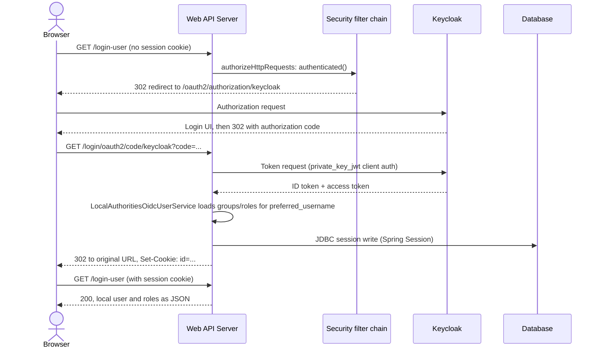
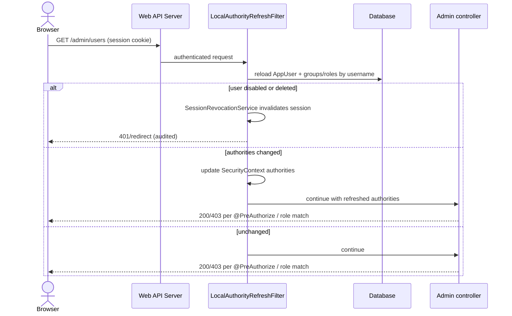
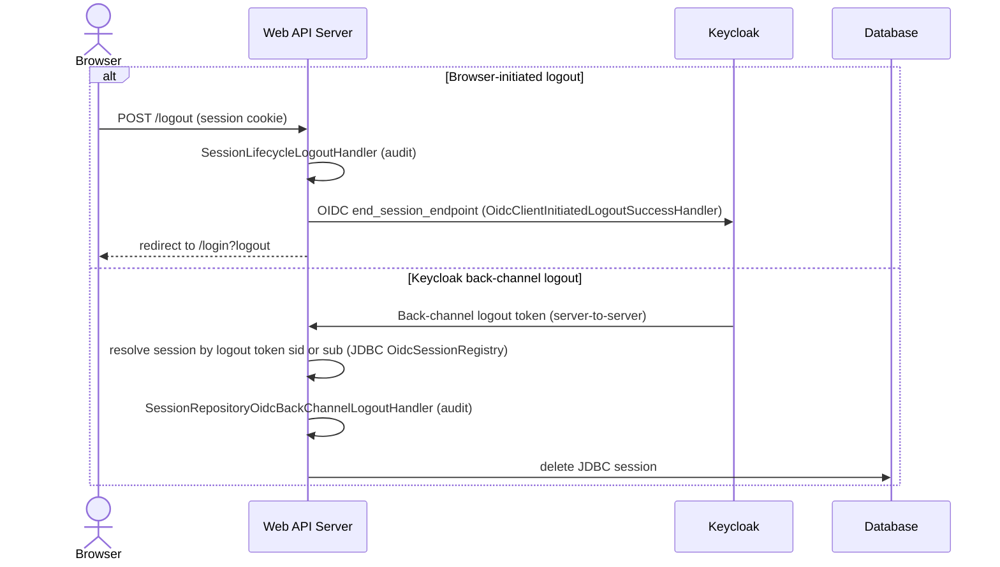
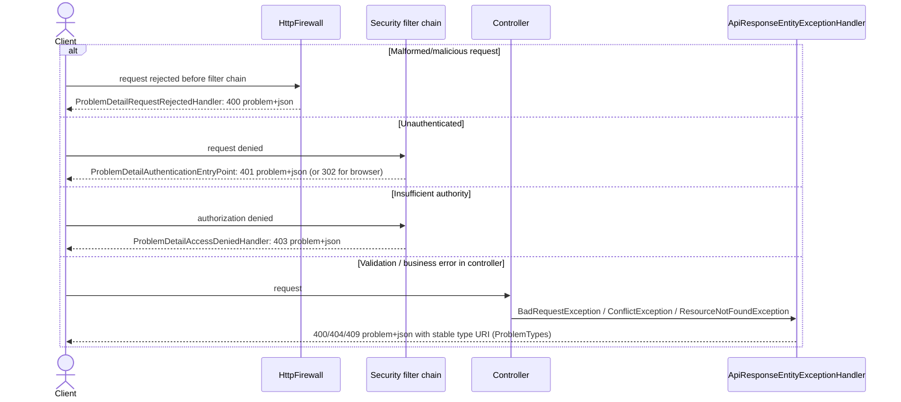

# 6. Runtime View

## Scenario: OIDC Login

<!-- arc42-generated -->
**Overview:** A browser user with no session reaches a protected endpoint,
is redirected through Keycloak, and returns with a server-side session.
This is the entry point for every other scenario in this document.

**Steps:**

1. An unauthenticated request to any path other than `/app/health` or
   `/oauth2/jwks` (both permitted by the commons module's
   `WebSecurityAutoConfiguration` and `PrivateKeyJwtAutoConfiguration`) is
   denied by the `authorizeHttpRequests` rules in `WebSecurityConfiguration`,
   triggering the OAuth2 login entry point.
2. The browser is redirected to Keycloak's authorization endpoint and
   authenticates there; the application never sees the user's credentials.
3. Keycloak redirects back with an authorization code, which the
   application exchanges for tokens using `private_key_jwt` client
   authentication (`RestClientAuthorizationCodeTokenResponseClient` with
   `NimbusJwtClientAuthenticationParametersConverter`), not a client secret.
4. `LocalAuthoritiesOidcUserService` resolves the user's local authorities
   through the application's `LocalAuthorityLookup` (here commons-accounts'
   `AppUserLocalAuthorityLookup`, reading `app_user`/`app_group`/`app_role`) by
   matching Keycloak's
   `preferred_username` claim, per
   [ADR 0005](../adr/0005-keycloak-authentication-local-authorisation.md).
5. A server-side session is created and persisted via Spring Session JDBC;
   the browser receives only the opaque `id` session cookie.
6. `SessionLifecycleAuditInitializationFilter` logs the session-creation
   audit event on the very next request, since no single Spring event
   reliably covers every path a session can be created through
   ([ADR 0009](../adr/0009-session-audit-initialization-checked-every-request.md)).
<!-- /arc42-generated -->

## Scenario: Authenticated Request with Per-Request Authority Refresh

<!-- arc42-generated -->
**Overview:** Every authenticated request re-derives the caller's
authorities from the database rather than trusting what was cached at
login, so an administrative change (disabling a user, changing group
membership) takes effect on the very next request.

**Steps:**

1. `LocalAuthorityRefreshFilter` runs after `RequestLoggingFilter` on every
   authenticated request and reloads the user's current authorities through
   the application's `LocalAuthorityLookup` (commons-accounts'
   `AppUserLocalAuthorityLookup`, backed by `AppUserRepository`).
2. If the user has been disabled or deleted, `SessionRevocationService`
   terminates the session immediately and the event is audited, rather
   than letting a stale session remain valid until its own timeout.
3. If authorities changed (role/group membership), the `SecurityContext`
   is updated in place for this request; a cache of the previous
   authority set is never consulted.
4. The request proceeds to the matched controller, where
   `authorizeHttpRequests` path rules (`/admin/users/**` requires
   `USER_MANAGE`, etc.) and method-level `@PreAuthorize` are evaluated
   against the just-refreshed authorities. See
   [ADR 0015](../adr/0015-per-request-local-authority-refresh.md).
<!-- /arc42-generated -->

## Scenario: Logout

<!-- arc42-generated -->
**Overview:** Logout is either browser-initiated or driven by Keycloak's
OIDC back-channel logout (for example, an administrator forcing logout
in Keycloak), and both paths converge on the same audited session
termination.

**Steps:**

1. A browser-initiated logout runs `SessionLifecycleLogoutHandler` (audit
   log) before Spring Security's own logout handling, then redirects
   through Keycloak's `end_session_endpoint` so the identity provider's
   own session is also terminated, landing back on `/login?logout`.
2. Keycloak can independently terminate a session out-of-band (for
   example, an administrator disabling the account in Keycloak); this
   arrives as an OIDC back-channel logout token (`oidcLogout().backChannel()`)
   and is handled without any browser round trip.
   `SessionRepositoryOidcBackChannelLogoutHandler` finds the local session
   linked to the token's `sid` or `sub` in the JDBC
   `OidcSessionRegistry` and deletes it from the JDBC repository. The link
   is in the database, so the notification can reach any instance (see
   [Back-channel logout](08-crosscutting-concepts/02-security-and-authentication/authentication.md#back-channel-logout)).
3. Both paths end the same JDBC-backed session and log a `destroy_session`
   event, whose `session.termination_reason` (`logout` or
   `back_channel_logout`) records which path was taken.
<!-- /arc42-generated -->

## Scenario: Error Handling

<!-- arc42-generated -->
**Overview:** Every error path returns RFC 9457 Problem Details
(`application/problem+json`) rather than a framework default page,
including errors that occur before Spring Security's own filters run.

**Steps:**

1. Firewall-rejected requests (Spring Security's `StrictHttpFirewall`,
   for example a malformed path) are handled by
   `ProblemDetailRequestRejectedHandler` instead of the framework's
   default bare `sendError(400)` logged at `DEBUG` through
   commons-logging, and are still logged in this application's structured
   format because `RequestCorrelationContextFilter` runs ahead of the
   security filter chain ([ADR 0012](../adr/0012-request-correlation-ahead-of-security-chain.md)).
2. Content negotiation determines the response shape: a browser-originated
   request without a session is redirected to the Keycloak login entry
   point (`ProblemDetailAuthenticationEntryPoint` preserves that redirect);
   an API client instead receives `401 application/problem+json`.
3. Authorization denials use `ProblemDetailAccessDeniedHandler`.
4. Controller-level exceptions (`BadRequestException`, `ConflictException`,
   `ResourceNotFoundException`) and Bean Validation failures are mapped by
   `ApiResponseEntityExceptionHandler` to Problem Details with a stable
   `type` URI from `ProblemTypes`, per
   [ADR 0013](../adr/0013-rfc-9457-problem-details.md).
<!-- /arc42-generated -->
