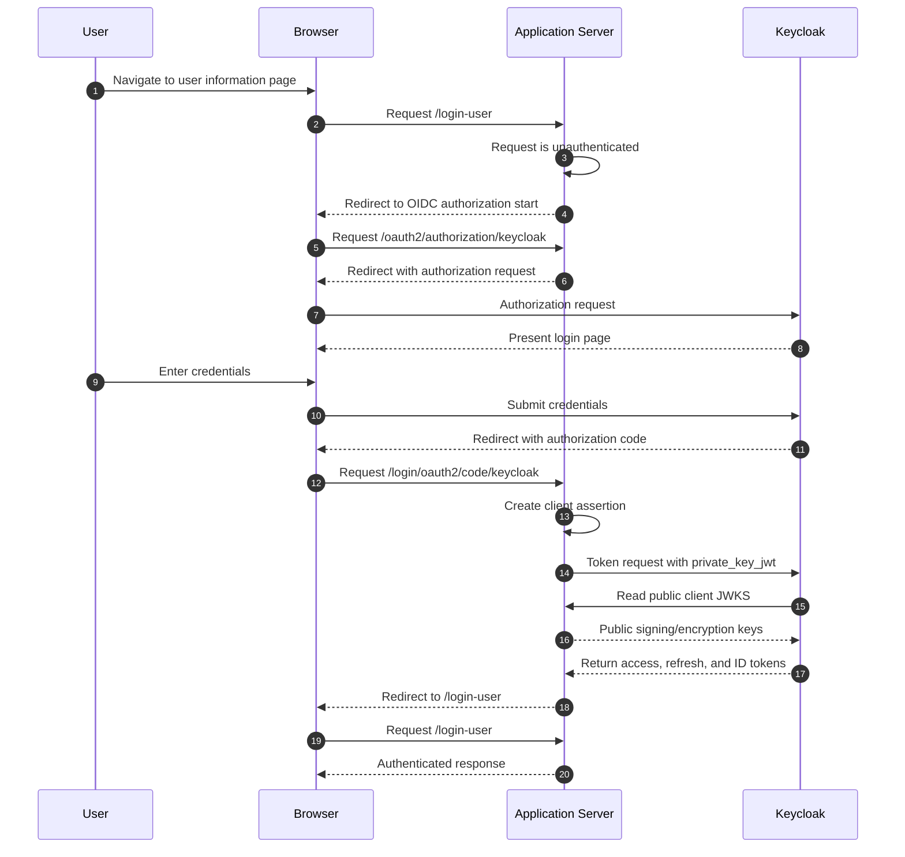

# 6. Runtime View

## Request handling shape

Every request passes through, in order: Tomcat, Spring Security's
`HttpFirewall` (rejecting malformed requests before they reach any filter),
the authentication/session/authorization filter chain, then Spring MVC
controllers in `api`. Errors at any stage are normalized to RFC 9457 Problem
Details rather than leaking stack traces or framework-specific error pages;
see [Error responses](08-crosscutting-concepts/security/error-responses.md)
for the full mapping and [ADR 0013](../adr/0013-rfc-9457-problem-details.md)
for why.

## OIDC authorization-code flow

The application is an OIDC relying party for Keycloak; see
[Authentication](08-crosscutting-concepts/security/authentication.md) for
the client configuration this sequence depends on.

