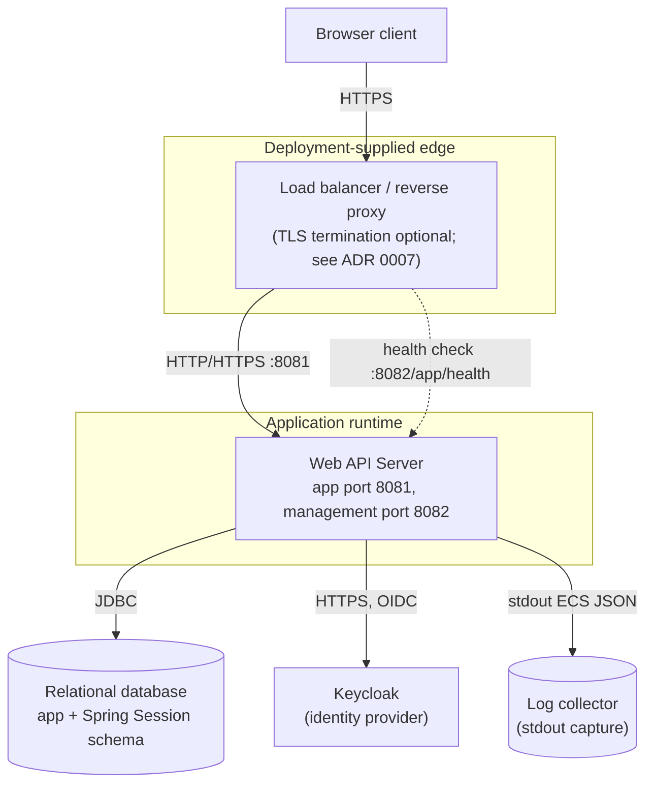
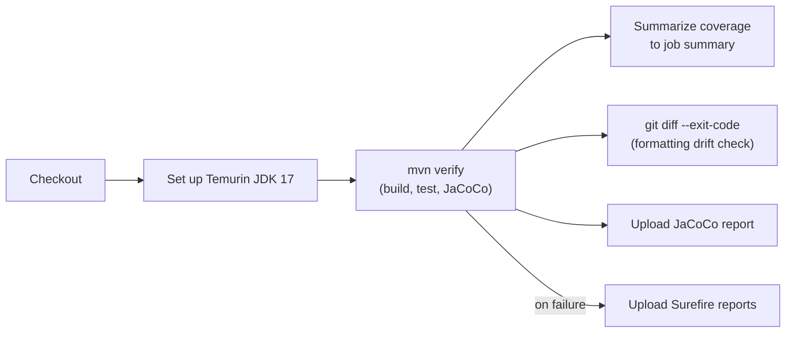

# 7. Deployment View

## Infrastructure Level 1

<!-- arc42-generated -->

**Motivation:** The application is a single deployable artifact (JAR or
GraalVM native binary) with two listeners: the application port (8081)
serving all business traffic, and a separate management port (8082,
base path `/app`) exposing only an unauthenticated health check for the
load balancer, per [ADR 0014](../adr/0014-actuator-management-port.md).
Everything outside the application runtime box (edge/TLS termination,
database, Keycloak, log collection) is a deployment decision required,
not something this template provisions.
<!-- /arc42-generated -->

### Building Block to Infrastructure Mapping

<!-- arc42-generated -->
| Building Block | Infrastructure Element | Notes |
| --- | --- | --- |
| `api`, `api.admin`, `config`, `security`, `logging` | Application runtime (single JVM process or native binary) | No internal service split; one deployable unit. |
| `domain` (JPA entities/repositories) | Relational database | Schema owned by Liquibase; runtime DB account must not have DDL privileges ([ADR 0004](../adr/0004-database-schema-management.md)). |
| Spring Session JDBC tables | Same relational database | Shares the database with the application schema; no separate session store is provisioned. |
| TLS termination | Load balancer/reverse proxy, or the application's own `server.ssl` (PEM bundle via `CERTIFICATE_PEM`/`PRIVATE_KEY_PEM`/`CA_BUNDLE_PEM`) | Production TLS 1.2/1.3 with a fixed strong cipher list is configured either way; which layer terminates TLS is a deployment decision required. |
| Health probe | Load balancer / orchestrator, targeting management port 8082 | Only `/app/health` is exposed and unauthenticated; every other Actuator endpoint is both unexposed and would require authentication if enabled. |
| Log collection | Deployment-supplied stdout capture (container log driver, sidecar, etc.) | The application only writes structured JSON to stdout; shipping/retention is a deployment responsibility. |
<!-- /arc42-generated -->

### Environment Overview

<!-- arc42-generated -->
| Environment | Purpose | URL | Notes |
| --- | --- | --- | --- |
| Local (HTTP) | Local development without TLS | `http://localhost:8081` | `mvn -Plocal spring-boot:run`; `application-local.yaml` disables TLS and marks the session cookie non-secure. Uses the `java-app-web-api-server` Keycloak client. |
| Local (TLS) | Local development with TLS, matching production cookie/header behavior | `https://localhost:8081` | `./bin/start-api-server-tls.sh` generates development-only certificates under `.local/certs` and starts Keycloak's `java-app-web-api-server-secure` client. Trust `.local/certs/local-ca.pem` before use. |
| Test | Automated test execution | N/A | `application-test.yaml` + H2 (`com.h2database:h2`, test scope only). |
| Production | Adopter-operated deployment | (deployment-specific) | Concrete infrastructure, database product, Keycloak realm, and TLS termination point are deployment decisions required; not fixed by this template. |
<!-- /arc42-generated -->

## Infrastructure Level 2

<!-- arc42-generated -->
### Build and Delivery Pipeline

`.github/workflows/build-and-test.yml` runs on every pull request and
push to `main`:

This pipeline builds and verifies the application; it does not itself
deploy anywhere. Container image build/push and environment-specific
deployment are not present in the repository and are a deployment
decision required.
<!-- /arc42-generated -->

<!-- arc42-manual: Document the actual deployment target(s) once chosen: container orchestrator or PaaS, image build/registry, secrets management for CERTIFICATE_PEM/PRIVATE_KEY_PEM/CA_BUNDLE_PEM and OAuth2 client keys, database provisioning, and network/firewall rules restricting the management port (8082) to the health-check and internal ops network only (see ADR 0014). -->
<!-- /arc42-manual -->
