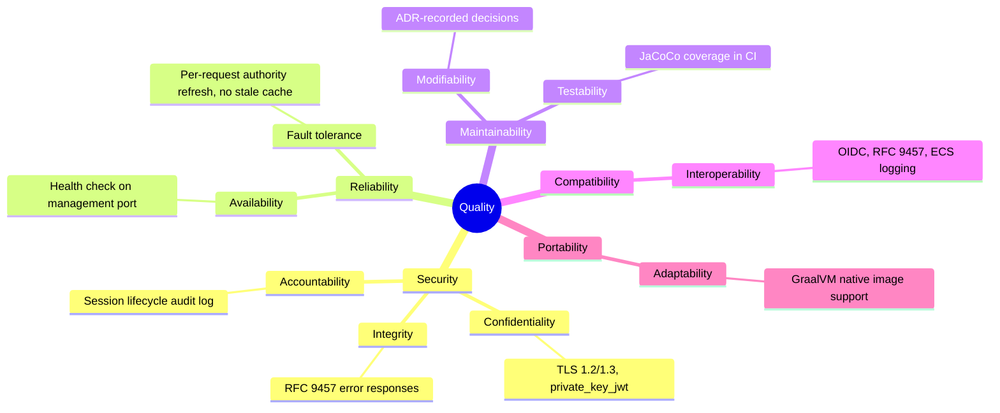

# 10. Quality Requirements

Quality characteristics referenced here use ISO/IEC 25010:2023 terminology,
kept as reference material rather than paraphrased in
[docs/standards/iso-25010-2023-quality-characteristics.md](../standards/iso-25010-2023-quality-characteristics.md).

## 10.1 Quality Tree

<!-- arc42-generated -->

<!-- /arc42-generated -->

## 10.2 Quality Scenarios

<!-- arc42-generated -->
| # | Quality Attribute | Scenario | Stimulus | Response | Metric/Target |
| --- | --- | --- | --- | --- | --- |
| 1 | Security (Confidentiality) | An attacker attempts to intercept traffic between a browser and the application in production. | Network-level interception attempt. | Traffic is encrypted with TLS 1.2/1.3 using only the configured strong cipher suites (`server.ssl.ciphers`). | Plaintext cipher suites and TLS < 1.2 are never negotiable. |
| 2 | Security (Accountability) | A user's session is created, evicted by the concurrent-session limit, or expires by absolute timeout. | Session lifecycle event occurs. | The event is logged via `SessionLifecycleAuditLogger` with a random audit identifier distinct from the session ID. | Every lifecycle transition produces exactly one audit log line, reconstructable independent of the session ID. |
| 3 | Security (Non-repudiation of authorization) | An administrator disables a user or removes a role grant. | Next request from the affected user. | `LocalAuthorityRefreshFilter` reloads authorities from the database on that request; a disabled user's session is revoked immediately via `SessionRevocationService`. | Authorization changes take effect on the very next request, not at next login or token refresh. |
| 4 | Reliability (Availability monitoring) | A load balancer or orchestrator polls the application's health. | `GET /app/health` (management port 8082). | `200` when healthy, without leaking component detail (`show-details: never`, `show-components: never`). | No authentication required for this single endpoint; no other detail exposed. |
| 5 | Maintainability (Testability) | A pull request changes application code. | CI runs `mvn verify`. | JaCoCo instruction/line/branch coverage is computed and posted to the job summary. | Coverage is visible on every pull request (no enforced minimum threshold is currently configured; see Risks). |
| 6 | Maintainability (Modifiability) | A future contributor needs to understand why a decision was made. | Review of an existing mechanism (for example, why sessions are JDBC-backed). | The rationale is in a linked ADR under `docs/adr/`, not re-derived from code archaeology. | Every consequential decision referenced from [Architecture Decisions](09-architecture-decisions.md) has a corresponding ADR. |
| 7 | Compatibility (Interoperability) | A non-browser API client calls a protected endpoint without a session. | `GET /admin/users` with no session cookie, `Accept: application/json`. | `401` with an `application/problem+json` body (not an HTML login redirect). | Content negotiation returns the correct representation for the client type in 100% of error responses. |
<!-- /arc42-generated -->

<!-- arc42-manual: Add quality scenarios with concrete, measured targets (e.g. p95 response time under a defined load) once performance testing exists; none is present in the codebase today. -->
<!-- /arc42-manual -->
